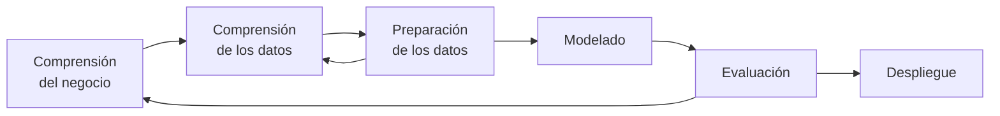

# Ayudantía 02 — Comprensión y preparación de datos

> **Objetivo:** reconocer las ideas y herramientas que permiten obtener, explorar y preparar datos antes de entrenar un modelo.
>
> Esta guía acompaña el enunciado. Contiene conceptos, vocabulario y preguntas orientadoras, pero no las respuestas de los ejercicios.

---

## 0. El recorrido de los datos

```text
Problema de negocio
        ↓
Obtener datos (archivos o web)
        ↓
Comprenderlos (estructura, tipos, calidad, distribución)
        ↓
Prepararlos (limpiar, transformar, seleccionar)
        ↓
Modelar y evaluar
```

Los ejercicios recorren ese camino:

| Ejercicios | Tema |
| --- | --- |
| 1 | CRISP-DM |
| 2 | CSV y exploración con Pandas |
| 3–4 | Peticiones HTTP, HTML y BeautifulSoup |
| 5 | Expresiones regulares |
| 6–7 | Métodos Filter para seleccionar características |
| 8 | Integración de las etapas en un mini-pipeline |

La pregunta que conecta toda la sesión es:

> ¿Qué necesitamos conocer y decidir sobre los datos antes de usarlos para entrenar un modelo?

---

## 1. CRISP-DM: ubicar cada tarea

CRISP-DM es una metodología para organizar proyectos de minería de datos y Machine Learning. Sus fases no forman una línea rígida: es posible regresar a una etapa anterior cuando aparece nueva información.



| Fase | Pregunta general |
| --- | --- |
| **Business Understanding** | ¿Qué necesidad existe y cómo se reconocerá una solución útil? |
| **Data Understanding** | ¿Qué datos hay y qué podemos aprender al examinarlos? |
| **Data Preparation** | ¿Qué cambios necesitan los datos antes de utilizarlos? |
| **Modeling** | ¿Cómo se construirá una solución a partir de los datos? |
| **Evaluation** | ¿El resultado responde adecuadamente al problema original? |
| **Deployment** | ¿Cómo se entregará, utilizará o mantendrá el resultado? |

### Preguntas para pensar antes de responder

- ¿Observar un problema en los datos es lo mismo que modificarlo?
- ¿Elegir una técnica pertenece a la misma fase que examinar la calidad de una tabla?
- Si un modelo obtiene un buen resultado numérico, ¿qué otras condiciones podrían volverlo poco útil?
- ¿Qué flechas del diagrama muestran que CRISP-DM es iterativo?

---

## 2. CSV, Pandas y exploración inicial

### ¿Qué es un archivo CSV?

CSV significa *Comma-Separated Values*. Es un archivo de texto que representa información tabular:

```csv
nombre,edad,ciudad
Ana,20,Coquimbo
Pedro,25,La Serena
```

En términos generales:

- Cada línea representa una fila.
- Un separador, como la coma, divide las columnas.
- La primera línea suele contener los nombres de las columnas.
- Aunque se parezca a una hoja de cálculo, sigue siendo texto plano.

No todos los CSV usan coma: algunos utilizan punto y coma, tabulación u otra codificación. Por eso, al cargar uno también importa conocer su formato.

### ¿Qué es Pandas?

Pandas es una biblioteca de Python para trabajar con datos tabulares. Su estructura principal es el `DataFrame`, que organiza observaciones en filas y variables en columnas.

```text
DataFrame
├── filas: observaciones o casos
└── columnas: variables o atributos
```

Cuando se recibe un dataset desconocido, normalmente interesa investigar:

- Qué dimensiones tiene.
- Cómo se llaman sus columnas.
- Qué tipo de dato parece contener cada una.
- Si hay celdas sin información.
- Qué valores son habituales y cuáles llaman la atención.

### Cómo leer un fragmento de Pandas

Ante cada línea de código, conviene separar cuatro elementos:

1. **Objeto:** ¿sobre qué variable se está trabajando?
2. **Operación:** ¿qué sugiere el nombre de la función o método?
3. **Argumentos:** ¿qué información se entrega entre paréntesis?
4. **Salida:** ¿se crea un objeto, se devuelve un resumen o se imprime algo?

Con el código del enunciado, observa antes de responder:

- ¿Qué línea crea la variable `df`?
- ¿Cuáles operaciones se ejecutan sobre `df`?
- ¿Las tres salidas muestran filas individuales o resúmenes?
- ¿Alguna salida permite comparar cuántos datos existen con cuántos deberían existir?
- ¿Qué significan palabras como `count`, `mean`, `min`, `max` y `50%`?

Para explorar por cuenta propia en Python también se puede utilizar `help(...)`, por ejemplo:

```python
help(pd.read_csv)
```

### Valores faltantes

Un valor faltante representa información desconocida o no registrada. Según el origen de los datos, puede aparecer como una celda vacía, `NA`, `NaN`, `null`, `None` u otro marcador.

Preguntas útiles:

- ¿Cómo distinguirías un cero real de una celda sin información?
- ¿Qué comparación permitiría saber si una columna está completa?
- ¿Todos los valores faltantes deberían tratarse de la misma forma?

### Estadística descriptiva

Un resumen estadístico puede incluir medidas de:

- **Cantidad:** número de observaciones disponibles.
- **Tendencia central:** valores alrededor de los cuales se concentran los datos.
- **Dispersión:** cuánto varían las observaciones.
- **Posición:** cuartiles, mínimo y máximo.

Al leer un resumen, no basta con copiar los números. Pregúntate qué dicen sobre el rango, la escala y la forma probable de los datos.

---

## 3. Peticiones HTTP y la biblioteca Requests

### ¿Qué es una petición HTTP?

HTTP es un protocolo de comunicación entre un cliente y un servidor. Cuando un navegador o un programa solicita una página, ocurre un intercambio:

```text
Cliente  ── petición HTTP ──>  Servidor
Cliente  <── respuesta HTTP ── Servidor
```

La petición indica qué recurso se desea y qué acción se quiere realizar. El método `GET` se utiliza normalmente para solicitar un recurso.

La respuesta puede contener:

- Un código de estado.
- Encabezados o *headers* con metadatos.
- Un cuerpo o *body* con el contenido solicitado.

### ¿Qué es Requests?

`requests` es una biblioteca de Python que permite enviar peticiones HTTP y trabajar con la respuesta como un objeto.

```python
import requests

response = requests.get("https://example.com")
```

No es necesario memorizar todos los códigos de estado, pero sí reconocer sus familias:

| Familia | Idea general |
| --- | --- |
| `1xx` | Información |
| `2xx` | Resultado satisfactorio |
| `3xx` | Redirección |
| `4xx` | Problema asociado a la solicitud del cliente |
| `5xx` | Problema asociado al servidor |

### Texto y bytes

El cuerpo de una respuesta puede observarse como caracteres ya decodificados o como bytes originales. La representación adecuada depende de lo que se haya descargado.

Para razonar sobre el código del enunciado:

- ¿A qué familia pertenece el código mostrado?
- ¿Qué información podría encontrarse en `Content-Type`?
- ¿Qué representación sería más cómoda para analizar HTML?
- ¿Cuál sería más apropiada para guardar una imagen o un PDF sin modificar sus bytes?
- ¿Qué mostrarían `type(response.text)` y `type(response.content)`?

---

## 4. HTML y BeautifulSoup

### ¿Qué es HTML?

HTML describe la estructura de una página mediante etiquetas anidadas. Una tabla puede contener:

| Etiqueta | Idea asociada |
| --- | --- |
| `<table>` | Tabla completa |
| `<tr>` | Fila de la tabla |
| `<th>` | Celda de encabezado |
| `<td>` | Celda de datos |

Por ejemplo:

```html
<table>
  <tr><th>Producto</th><th>Precio</th></tr>
  <tr><td>Cuaderno</td><td>2500</td></tr>
</table>
```

### ¿Qué hace BeautifulSoup?

BeautifulSoup transforma un texto HTML en una estructura que Python puede recorrer y consultar. Algunos métodos útiles son:

| Operación | Pregunta que ayuda a responder |
| --- | --- |
| `find(...)` | ¿Dónde está la primera etiqueta que cumple una condición? |
| `find_all(...)` | ¿Cuáles son todas las etiquetas que cumplen una condición? |
| `get_text(...)` | ¿Qué texto contiene un elemento? |

### Del árbol HTML a una tabla

Un `DataFrame` necesita dos cosas: nombres de columnas y filas de datos. Al estudiar el ejemplo del enunciado, piensa:

- ¿Qué etiqueta agrupa cada fila?
- ¿Cómo se diferencian los encabezados de las celdas normales?
- ¿Qué resultado produce la comprensión de lista dentro del `print`?
- ¿Qué parte debería transformarse en los nombres de columnas?
- ¿Qué tipo de dato tendrá una edad recién extraída desde HTML?

La dificultad no está solo en encontrar etiquetas, sino en transformar una estructura jerárquica en una tabla coherente.

---

## 5. Expresiones regulares

Una expresión regular, o *regex*, es una forma de describir patrones de texto. Resulta útil cuando muchas cadenas siguen una convención, por ejemplo códigos, fechas, correos o nombres de archivos.

### Símbolos útiles

| Patrón | Significado |
| --- | --- |
| `^` | Inicio de la cadena |
| `$` | Final de la cadena |
| `\d` | Un dígito |
| `\d+` | Uno o más dígitos |
| `\.` | Un punto literal |
| `[A-Za-z]` | Una letra dentro de esos rangos |
| `[...]+` | Uno o más caracteres del conjunto |
| `(...)` | Grupo de captura |
| `(?P<nombre>...)` | Grupo de captura con nombre |
| `(?:...)` | Grupo que organiza, pero no captura |

En Python suele escribirse una regex como *raw string* (`r"..."`) para que las barras invertidas lleguen al motor de expresiones regulares sin interpretaciones adicionales.

### Estrategia para construir una regex

1. Separar visualmente la cadena en campos y separadores.
2. Marcar qué partes son fijas y cuáles cambian.
3. Describir cada fragmento variable con una regla pequeña.
4. Capturar solamente la información que se desea conservar.
5. Probar el patrón y revisar si realmente hubo una coincidencia.

Antes de escribir el patrón del ejercicio, identifica:

- ¿Qué guiones bajos actúan como separadores?
- ¿Qué prefijos indican el significado del valor que viene después?
- ¿Qué campos son enteros y cuál puede contener un punto decimal?
- ¿Qué nombres deberían tener los grupos capturados?
- ¿Qué debería ocurrir si una cadena no respeta el formato?

---

## 6. Selección de características con métodos Filter

Una **característica**, **atributo** o *feature* es una variable de entrada. La variable que se quiere explicar o predecir se denomina **objetivo** o *target*.

Los métodos **Filter** utilizan una medida estadística para examinar la relación entre cada atributo y el objetivo antes de entrenar un modelo.

```text
Atributos ── medida estadística ──> puntuaciones ──> posible selección
```

Son rápidos e independientes del modelo que se utilizará después. Sin embargo, mirar cada atributo por separado puede ocultar relaciones que solo aparecen al combinar variables.

La elección de la medida depende de la naturaleza de los datos:

| Atributo | Objetivo | Método |
| --- | --- | --- |
| Categórico | Categórico | Prueba $\chi^2$ |
| Numérico | Numérico | Correlación de Pearson |

Antes de calcular, clasifica cada variable del ejercicio como categórica o numérica.

---

## 7. $\chi^2$ y tablas de contingencia

Una tabla de contingencia cruza dos variables categóricas y cuenta cuántas observaciones aparecen en cada combinación.

| Atributo | Clase A | Clase B | Total fila |
| --- | ---: | ---: | ---: |
| Categoría 1 | $O_{11}$ | $O_{12}$ | $F_1$ |
| Categoría 2 | $O_{21}$ | $O_{22}$ | $F_2$ |
| **Total columna** | $C_1$ | $C_2$ | $N$ |

Las celdas interiores contienen frecuencias observadas. Los totales de filas y columnas se llaman frecuencias marginales.

### Observado frente a esperado

La prueba compara lo que aparece en los datos con lo que cabría esperar si las variables fueran independientes:

$$
E_{ij}=\frac{(\text{total de la fila }i)(\text{total de la columna }j)}{\text{total general}}
$$

Luego utiliza el estadístico:

$$
\chi^2=\sum_{i,j}\frac{(O_{ij}-E_{ij})^2}{E_{ij}}
$$

En vez de memorizarlo mecánicamente, examina la fórmula:

- ¿Qué ocurre con la contribución de una celda cuando $O_{ij}=E_{ij}$?
- ¿Qué ocurre cuando aumenta la diferencia entre ambos valores?
- ¿Para qué sirve elevar la diferencia al cuadrado?
- ¿Cuántos términos tendrá la suma en una tabla de dos por dos?
- ¿Qué comparación permitiría ordenar varios atributos?

Una buena práctica es escribir cada término por separado antes de sumarlos y comprobar que las frecuencias esperadas conservan los totales de la tabla.

---

## 8. Correlación de Pearson

La correlación de Pearson resume la relación **lineal** entre dos variables numéricas mediante un valor entre $-1$ y $1$.

$$
r_{XY}=\frac{\sum_{i=1}^{n}(x_i-\bar{x})(y_i-\bar{y})}
{\sqrt{\sum_{i=1}^{n}(x_i-\bar{x})^2}\sqrt{\sum_{i=1}^{n}(y_i-\bar{y})^2}}
$$

La fórmula combina:

- La media de cada variable.
- La distancia de cada observación respecto de su media.
- El signo de los productos entre esas desviaciones.
- La escala total de variación de ambas variables.

Para ordenar los cálculos a mano, define $d_{x,i}=x_i-\bar{x}$ y $d_{y,i}=y_i-\bar{y}$. Así la tabla auxiliar se mantiene compacta:

| $x_i$ | $y_i$ | $d_{x,i}$ | $d_{y,i}$ | $d_{x,i}d_{y,i}$ | $d_{x,i}^2$ | $d_{y,i}^2$ |
| ---: | ---: | ---: | ---: | ---: | ---: | ---: |
|  |  |  |  |  |  |  |

Preguntas para interpretar el resultado:

- ¿Qué patrón de signos aparece cuando ambas variables crecen juntas?
- ¿Qué patrón aparece cuando una crece mientras la otra disminuye?
- ¿Qué diferencia existe entre la dirección y la fuerza de una relación?
- Si dos resultados están a la misma distancia de cero, pero tienen signos opuestos, ¿qué comparten y en qué se diferencian?
- ¿Puede existir una relación no lineal aunque Pearson sea cercano a cero?

Correlación no implica causalidad: dos variables pueden cambiar juntas sin que una sea la causa de la otra.

---

## 9. Pensar un mini-pipeline

Un pipeline organiza varias operaciones para que los datos avancen desde una entrada hasta un resultado reproducible.

```text
CSV → inspección → calidad → selección → visualización
```

El desafío final se puede abordar buscando una operación para cada necesidad. Pandas permite cargar tablas, consultar tipos, identificar valores faltantes, calcular relaciones entre columnas, filtrar resultados y ordenarlos. Matplotlib permite representar visualmente una variable.

No es necesario resolver todo en una única instrucción. Antes de programar, escribe con palabras:

1. ¿Qué debe entrar al pipeline?
2. ¿Qué comprobaciones necesita el archivo?
3. ¿Qué columnas pueden participar en el cálculo solicitado?
4. ¿Hay alguna columna que no debería competir consigo misma?
5. ¿Cómo se obtienen exactamente tres resultados?
6. ¿Qué variable tendría sentido visualizar y qué mostraría el gráfico?

> **Para ejecutar el ejercicio:** se necesita un `dataset.csv` que contenga una columna `target` y suficientes atributos numéricos. Sin ese archivo se puede diseñar el algoritmo, pero no comprobarlo de extremo a extremo.

---

## 10. Preguntas de control

Antes de dar una respuesta por terminada, revisa:

- ¿Estoy describiendo lo que hace el código o solo repitiendo su nombre?
- ¿Distingo una fila de datos de un encabezado HTML?
- ¿Sé qué tipo de objeto produce cada operación?
- ¿Mi expresión regular contempla las partes variables y los separadores?
- ¿Distingo una frecuencia observada de una esperada?
- ¿Revisé todos los términos de la suma?
- ¿Estoy interpretando por separado el signo y la distancia respecto de cero?
- ¿El pipeline excluye elementos que podrían producir un resultado trivial?

---

## 11. Checklist de aprendizaje

- [ ] Puedo explicar qué es un CSV y qué representa un `DataFrame`.
- [ ] Reconozco las seis fases de CRISP-DM.
- [ ] Puedo leer una línea de Pandas identificando objeto, operación, argumentos y salida.
- [ ] Comprendo las partes generales de una petición y una respuesta HTTP.
- [ ] Puedo relacionar una tabla HTML con filas, encabezados y datos.
- [ ] Reconozco los símbolos básicos de una expresión regular.
- [ ] Distingo variables categóricas de variables numéricas.
- [ ] Comprendo la diferencia entre frecuencia observada y esperada.
- [ ] Puedo organizar los componentes necesarios para calcular Pearson.
- [ ] Puedo diseñar los pasos de un pequeño pipeline antes de programarlo.

### Guías relacionadas

- [Guía 03 — Nivelación Python para Data Science](../guias/03-nivelacion-python.md)
- [Guía 04 — Glosario Técnico de Machine Learning](../guias/04-glosario-ml.md)
