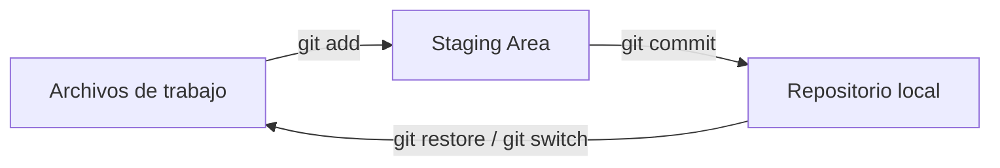
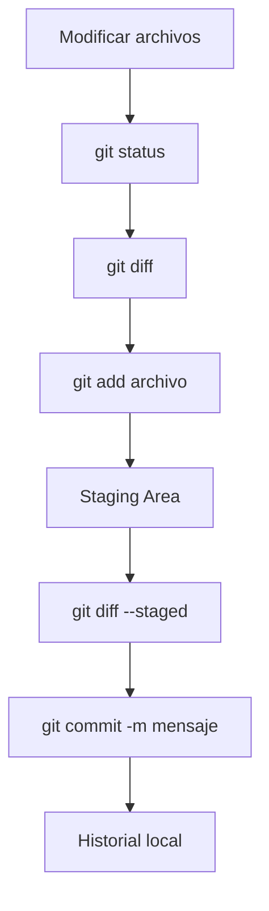

# Guía 01 — Git Básico

> **Objetivo:** aprender a usar Git desde cero para guardar versiones de un proyecto y trabajar de forma ordenada.
>
> Esta guía no necesita GitHub. Al terminar, deberías entender qué es un repositorio, cómo guardar cambios y cómo volver a versiones anteriores.

---

## 0. ¿Qué es Git?

**Git** es un sistema de control de versiones. Permite guardar el historial de un proyecto y saber qué cambió, cuándo cambió y quién hizo cada cambio.

Hay tres conceptos que conviene distinguir:

- **Git:** el programa que controla las versiones.
- **Repositorio:** la carpeta de tu proyecto administrada por Git.
- **Commit:** una versión guardada de los cambios.

Por ahora trabajaremos solo con Git localmente. Más adelante veremos cómo conectar nuestro repositorio con **GitHub**.

### La idea principal

Git puede entenderse como tres espacios: tus archivos de trabajo, la zona de preparación (*staging*) y el historial de commits.



`git add` prepara los cambios y `git commit` crea una nueva versión en el historial.

---

## 1. ¿Qué ventana debo abrir?

Todo lo que dice `git ...` se escribe en una **terminal**.

| Sistema | Qué abrir |
| --- | --- |
| **Windows** | PowerShell, CMD o Git Bash |
| **macOS** | Terminal |
| **Ubuntu / Linux** | Terminal |
| **Servidor de la universidad** | La terminal después de conectarte por `ssh` |

> No necesitas ser experto en terminal. En esta guía puedes copiar y pegar los comandos.

---

## 2. Comprobar si Git está instalado

En la terminal:

```bash
git --version
```

Si aparece algo como:

```text
git version 2.x.x
```

Git está instalado.

Si aparece `command not found` o un mensaje equivalente, primero debes instalar Git.

Puedes encontrar los instaladores oficiales en:

https://git-scm.com/downloads

---

## 3. Configurar Git

Git necesita saber tu nombre y tu correo para identificar tus commits.

Haz esto **una vez por cada computador o servidor** que uses:

```bash
git config --global user.name "Nombre Apellido"
git config --global user.email "tu.correo@gmail.com"
git config --global init.defaultBranch main
```

Por ejemplo:

```bash
git config --global user.name "Gael Ortega"
git config --global user.email "gael@gmail.com"
git config --global init.defaultBranch main
```

Puedes comprobar la configuración con:

```bash
git config --list
```

Deberías encontrar tu nombre y correo en la lista.

> **Importante:** no confundas el correo configurado en Git con la contraseña de GitHub. La autenticación con GitHub se verá en la siguiente guía.

---

## 4. Crear un repositorio

Supongamos que tienes una carpeta llamada `mi-proyecto`.

Entra a ella:

```bash
cd mi-proyecto
```

Luego inicializa Git:

```bash
git init -b main
```

Esto crea una carpeta oculta llamada `.git`, que contiene el historial del proyecto.

Puedes comprobarlo con:

```bash
git status
```

Deberías ver algo parecido a:

```text
On branch main
No commits yet
```

> **No borres la carpeta `.git`** si quieres conservar el historial del proyecto.

---

## 5. El ciclo básico de Git

Este es el flujo que usarás constantemente:



### 5.1 Ver qué cambió

```bash
git status
```

Este debería ser uno de los comandos que más uses.

Te muestra, entre otras cosas:

- archivos nuevos,
- archivos modificados,
- archivos eliminados,
- archivos preparados para el próximo commit.

---

### 5.2 Ver exactamente qué cambió

```bash
git diff
```

Esto muestra las diferencias que todavía **no** están preparadas para el commit.

Para salir de la vista de diferencias, presiona:

```text
q
```

Después de hacer `git add`, puedes revisar qué está preparado con:

```bash
git diff --staged
```

---

### 5.3 Preparar cambios con `git add`

Para agregar un archivo específico:

```bash
git add archivo.py
```

También puedes agregar varios:

```bash
git add archivo1.py archivo2.py
```

Existe también:

```bash
git add .
```

pero **no conviene usarlo a ciegas**. Antes revisa `git status` para asegurarte de que no estás agregando archivos que no deberían quedar en el repositorio.

Una buena costumbre es:

```bash
git status
git add archivo.py
git status
```

---

### 5.4 Crear un commit

Cuando ya tengas preparados los archivos:

```bash
git commit -m "Agregar modelo de regresión"
```

El mensaje debe explicar de forma breve qué cambió.

Buenos ejemplos:

```bash
git commit -m "Agregar preprocesamiento de datos"
git commit -m "Corregir calculo de accuracy"
git commit -m "Agregar notebook del laboratorio 02"
```

Evita mensajes poco útiles como:

```bash
git commit -m "cambios"
git commit -m "asdf"
git commit -m "final"
```

---

## 6. Ver el historial

Para ver los commits:

```bash
git log
```

Una vista más compacta:

```bash
git log --oneline
```

Ejemplo:

```text
8f31a2c Corregir calculo de accuracy
c4a9021 Agregar entrenamiento del modelo
7a12fd0 Inicializar proyecto
```

Cada commit tiene un identificador único.

---

## 7. Deshacer cambios

### Deshacer cambios que todavía no has preparado

Si modificaste un archivo y quieres volver a la última versión guardada por Git:

```bash
git restore archivo.py
```

> **Cuidado:** esto elimina los cambios no guardados de ese archivo.

### Sacar un archivo del staging

Si hiciste:

```bash
git add archivo.py
```

y después cambiaste de opinión:

```bash
git restore --staged archivo.py
```

El archivo seguirá modificado, pero ya no estará preparado para el commit.

---

## 8. Ramas (branches)

Una rama permite trabajar en una línea de desarrollo separada.

Ver las ramas actuales:

```bash
git branch
```

Crear una rama:

```bash
git branch nueva-funcionalidad
```

Cambiar a esa rama:

```bash
git switch nueva-funcionalidad
```

También puedes crear y cambiar a la rama en un solo comando:

```bash
git switch -c nueva-funcionalidad
```

Volver a `main`:

```bash
git switch main
```

Para un curso introductorio, puedes trabajar principalmente en `main` y aprender ramas cuando el laboratorio las requiera.

---

## 9. `.gitignore`: qué NO guardar en Git

En proyectos de Machine Learning hay archivos que normalmente no deberían formar parte del repositorio:

- entornos virtuales,
- claves y secretos,
- datasets grandes,
- modelos entrenados,
- resultados pesados,
- archivos temporales.

Crea un archivo llamado exactamente:

```text
.gitignore
```

Un ejemplo útil para Python y Machine Learning:

```gitignore
# Entornos virtuales
.conda/
env/
venv/

# Secretos
.env

# Python / Jupyter
__pycache__/
*.py[cod]
.ipynb_checkpoints/
.DS_Store

# Datos y resultados pesados
*.csv
*.parquet
*.pkl
*.joblib
data/
outputs/
artifacts/
```

Si quieres que las carpetas vacías aparezcan en el repositorio, puedes usar un archivo `.gitkeep`:

```bash
mkdir -p data outputs artifacts
touch data/.gitkeep outputs/.gitkeep artifacts/.gitkeep
```

> **Regla importante:** antes del primer `git add`, crea el `.gitignore`. Es mucho más fácil prevenir un error que quitar después un archivo del historial.

Si ya agregaste archivos por error antes de crear el `.gitignore`, puedes actualizar lo que Git está siguiendo con:

```bash
git rm -r --cached .
git add .
```

Esto los saca del seguimiento de Git sin borrarlos de tu disco.

---

## 10. Un flujo de trabajo recomendado

Cada vez que trabajes en un proyecto, acostúmbrate a seguir este orden:

```bash
git status

git diff

git add archivo1.py archivo2.ipynb

git diff --staged

git commit -m "Describir el cambio"
```

Piensa en esto como:

```text
status   → ¿qué cambió?
diff     → ¿qué cambié exactamente?
add      → ¿qué quiero guardar?
commit   → guardar una nueva versión
```

---

## 11. ¿Qué pasa con GitHub?

Hasta aquí todo ocurre **en tu computador o servidor**.

Git también puede conectarse a un repositorio remoto para compartir tu trabajo. El servicio que usaremos en el curso es **GitHub**.

La siguiente guía explica:

- cómo conectar Git con GitHub,
- cómo subir cambios con `git push`,
- cómo descargar cambios con `git pull`,
- cómo trabajar en el servidor de la universidad,
- cómo usar LazyGit,
- y otras herramientas opcionales.

---

## 12. Referencia rápida

| Comando | Para qué sirve |
| --- | --- |
| `git --version` | Ver la versión de Git |
| `git config --list` | Ver configuración |
| `git init` | Crear un repositorio |
| `git status` | Ver el estado |
| `git diff` | Ver cambios |
| `git add archivo` | Preparar cambios |
| `git diff --staged` | Ver lo preparado |
| `git commit -m "..."` | Crear una versión |
| `git log --oneline` | Ver historial |
| `git restore archivo` | Deshacer cambios no guardados |
| `git restore --staged archivo` | Sacar del staging |
| `git branch` | Ver ramas |
| `git switch rama` | Cambiar de rama |
