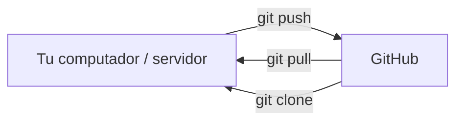
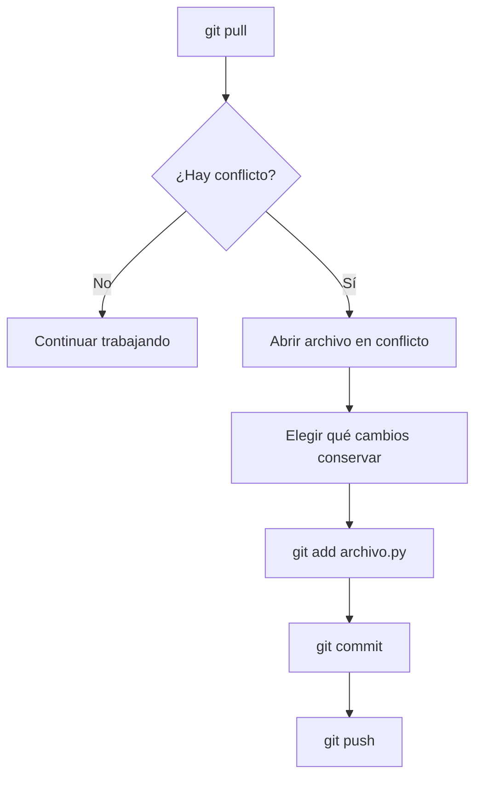

# Guía 01 — Git y GitHub

> **Objetivo:** conectar tu repositorio Git con GitHub y aprender el flujo de trabajo que usaremos en los laboratorios, tanto desde tu computador como desde el servidor de la universidad.

Esta guía asume que ya conoces los comandos básicos de Git vistos en la **Guía 01 — Git Básico**.

---

## 0. Git vs GitHub

Es importante no confundirlos:

- **Git:** controla versiones localmente.
- **GitHub:** almacena repositorios remotos y facilita compartir y colaborar.

La relación básica es:



Git sigue siendo el programa que controla versiones. GitHub es el repositorio remoto con el que sincronizas y compartes tu trabajo.

Tu trabajo sigue estando en Git localmente. GitHub es el lugar remoto con el que sincronizas ese trabajo.

---

## 1. Clonar un laboratorio existente

En el curso, lo más común será recibir un repositorio que ya existe en GitHub.

Por ejemplo:

```bash
git clone https://github.com/usuario/nombre-laboratorio.git
```

Después entra a la carpeta:

```bash
cd nombre-laboratorio
```

Puedes comprobar que estás dentro de un repositorio con:

```bash
git status
```

Y revisar a qué repositorio remoto está conectado con:

```bash
git remote -v
```

Deberías ver una salida parecida a:

```text
origin  https://github.com/usuario/nombre-laboratorio.git (fetch)
origin  https://github.com/usuario/nombre-laboratorio.git (push)
```

---

## 2. Crear un repositorio y conectarlo con GitHub

Si empiezas un proyecto desde cero, primero crea el repositorio local:

```bash
mkdir mi-proyecto
cd mi-proyecto
git init -b main
```

Crea primero el `.gitignore` y los archivos iniciales del proyecto.

Después:

```bash
git add .gitignore README.md
git commit -m "Inicializar proyecto"
```

Crea el repositorio correspondiente en GitHub y copia su dirección.

Luego conecta el repositorio local:

```bash
git remote add origin https://github.com/usuario/nombre-laboratorio.git
```

Comprueba la conexión:

```bash
git remote -v
```

Finalmente, sube tu rama `main`:

```bash
git push -u origin main
```

Después de eso, normalmente bastará con:

```bash
git push
```

---

## 3. Conectarte a GitHub desde la terminal

Para poder subir y descargar código desde GitHub usando la terminal, primero debes configurar una forma de autenticarte.

Cuando usas GitHub con **HTTPS**, tu contraseña normal de GitHub no funciona para `git push` y `git pull`. En su lugar, puedes utilizar un **Personal Access Token (PAT)**.

### 3.1 Crear un Token

Haz esto desde el **navegador**:

1. Entra a [GitHub](https://github.com/) e inicia sesión.
2. Haz clic en tu foto de perfil → **Settings**.
3. Busca **Developer settings** → **Personal access tokens**.
4. Selecciona **Tokens (classic)**.
5. Haz clic en **Generate new token (classic)**.
6. Ponle un nombre, por ejemplo:

```text
servidor-ucn
```

7. Define una fecha de expiración.
8. Marca los permisos que te indique el curso. Para trabajar con repositorios privados normalmente se necesita `repo`.
9. Haz clic en **Generate token**.
10. **Copia el token inmediatamente.** GitHub no volverá a mostrarlo.

> ⚠️ **Importante:** el token funciona como una contraseña. No lo compartas, no lo subas a GitHub y no lo pegues dentro de notebooks, scripts o archivos del proyecto.

### 3.2 Usar el Token

Cuando Git necesite autenticarte, puede aparecer:

```text
Username:
```

Escribe tu **usuario de GitHub**.

Después:

```text
Password:
```

Aquí debes **pegar el Token**, no tu contraseña de GitHub.

> Al pegar el token, la terminal no mostrará ningún carácter. Es normal. Pégalo y presiona Enter.

Más adelante, cuando hagas tu primer `git push`, Git te pedirá estas credenciales.

---

## 4. El flujo de trabajo del laboratorio

Este será el flujo más importante para el trabajo diario.

### Antes de empezar a trabajar

Si otras personas pueden haber subido cambios:

```bash
git pull
```

### Revisar tu estado

```bash
git status
git diff
```

### Preparar tus cambios

En vez de agregar todo a ciegas:

```bash
git add archivo.py
```

Luego revisa:

```bash
git diff --staged
```

### Guardar una nueva versión

```bash
git commit -m "Describir el cambio"
```

### Subir a GitHub

```bash
git push
```

En resumen:

```mermaid
flowchart TD
    A[git pull] --> B[Trabajar en el proyecto]
    B --> C[git status]
    C --> D[git diff]
    D --> E[git add ...]
    E --> F[git diff --staged]
    F --> G[git commit -m "..."]
    G --> H[git push]
```

En formato de comandos:

```text
1. git pull
2. trabajar
3. git status
4. git diff
5. git add ...
6. git diff --staged
7. git commit -m "..."
8. git push
```

> **Importante:** si estás trabajando en un repositorio compartido, hacer `git pull` antes de comenzar y `git push` al terminar ayuda a mantener el repositorio sincronizado.

---

## 5. `pull`, `fetch` y `push`

### `git push`

Envía tus commits locales al repositorio remoto:

```bash
git push
```

### `git pull`

Descarga cambios del remoto e intenta integrarlos en tu rama actual:

```bash
git pull
```

### `git fetch`

Descarga información nueva del remoto **sin integrar automáticamente los cambios**:

```bash
git fetch
```

Para comenzar, `pull` y `push` serán suficientes para la mayoría de los laboratorios.

---

## 6. Cuando aparece un conflicto

Un conflicto puede aparecer cuando dos personas modifican la misma parte de un archivo y Git no sabe cuál versión conservar.



Al hacer `git pull`, podrías encontrar algo como:

```text
CONFLICT (content): Merge conflict in archivo.py
```

Abre el archivo y busca marcas como:

```text
<<<<<<< HEAD
Tu versión
=======
Versión de otra persona
>>>>>>> otra-rama
```

Debes decidir qué código conservar, eliminar las marcas y guardar el archivo.

Después:

```bash
git add archivo.py
git commit -m "Resolver conflicto en archivo.py"
git push
```

> Si no entiendes un conflicto, **no borres código a ciegas**. Pide ayuda y muestra el mensaje que Git te entregó.

---

## 7. LazyGit

LazyGit es una interfaz para Git dentro de la terminal. Permite ver archivos, commits, ramas y operaciones de Git sin tener que memorizar todos los comandos.

> **Primero aprende Git. Después usa LazyGit como una interfaz más cómoda.**

### 7.1 Instalar LazyGit en el servidor Ubuntu

La VM del servidor utiliza Linux `x86_64` y puedes instalar LazyGit en tu carpeta personal **sin `sudo`**.

Pega este bloque completo:

```bash
mkdir -p ~/.local/bin
cd /tmp
curl -L -o lazygit.tar.gz https://github.com/jesseduffield/lazygit/releases/download/v0.64.1/lazygit_0.64.1_linux_x86_64.tar.gz
tar -xzf lazygit.tar.gz
mv lazygit ~/.local/bin/
chmod +x ~/.local/bin/lazygit
echo 'export PATH="$HOME/.local/bin:$PATH"' >> ~/.bashrc
source ~/.bashrc
```

Comprueba:

```bash
lazygit --version
```

Debe aparecer una versión de LazyGit. La instalación de esta guía fue probada con `0.64.1`.

Si aparece:

```text
command not found: lazygit
```

prueba:

```bash
~/.local/bin/lazygit --version
```

### 7.2 Usar LazyGit

Entra primero al repositorio:

```bash
cd ~/mi-laboratorio
```

Luego:

```bash
lazygit
```

Si ejecutas LazyGit fuera de un repositorio, puede aparecer:

```text
Not in a git repository.
```

Eso no significa que la instalación esté mal. Solo debes entrar a un repositorio Git.

### Atajos básicos

| Tecla | Acción |
| --- | --- |
| `Space` | Marcar / desmarcar archivo |
| `c` | Crear commit |
| `P` | Push |
| `p` | Pull |
| `?` | Mostrar ayuda |
| `q` | Salir |

LazyGit utiliza la configuración y autenticación de Git, por lo que no reemplaza Git ni GitHub: simplemente hace más cómoda su utilización.

---

## 8. GitHub Desktop (opcional)

Si trabajas desde tu computador personal y prefieres una interfaz gráfica, puedes utilizar **GitHub Desktop**.

https://desktop.github.com/

Una vez instalado:

1. Inicia sesión con tu cuenta de GitHub.
2. Agrega tu repositorio local.
3. Revisa los cambios.
4. Crea el commit.
5. Haz push.

> GitHub Desktop es una herramienta para tu computador. No es la herramienta que utilizaremos dentro del servidor Ubuntu.

---

## 9. Datos y resultados grandes con Drive (opcional)

GitHub no debe utilizarse como almacenamiento para datasets grandes, modelos entrenados o grandes cantidades de resultados.

En los laboratorios de Machine Learning podemos separar:

```text
GitHub
├── código
├── notebooks
├── configuraciones
├── README
└── archivos pequeños

Drive / almacenamiento externo
├── datasets
├── modelos
├── outputs
└── artifacts
```

Una herramienta útil para mover archivos entre el servidor y Drive es **rclone**.

### 9.1 Instalar rclone en el servidor sin `sudo`

```bash
mkdir -p ~/.local/bin
cd /tmp
curl -L -o rclone.zip https://downloads.rclone.org/rclone-current-linux-amd64.zip
unzip -o rclone.zip
cp rclone-*-linux-amd64/rclone ~/.local/bin/
chmod +x ~/.local/bin/rclone
echo 'export PATH="$HOME/.local/bin:$PATH"' >> ~/.bashrc
source ~/.bashrc
rclone version
```


### 9.2 Configurar Google Drive

En el servidor:

```bash
rclone config
```

La autorización puede requerir completar el proceso desde tu computador personal, porque el servidor no tiene navegador gráfico.

Sigue las instrucciones mostradas por `rclone` y utiliza tu cuenta institucional si el curso indica que debes almacenar allí los resultados.

Para comprobar la conexión:

```bash
rclone ls gdrive: --max-depth 1
```

### 9.3 Subir resultados

Por ejemplo:

```bash
rclone copy ./artifacts gdrive:ML-Laboratorios/Lab02/artifacts -P
```

Para revisar:

```bash
rclone ls gdrive:ML-Laboratorios/Lab02/artifacts
```

`copy` copia archivos sin borrar los que ya existan en el destino.

> **Cuidado con `sync`:** puede borrar archivos del destino para que sea un espejo exacto del origen.

---

## 10. Errores frecuentes

### `fatal: not a git repository`

No estás dentro de una carpeta administrada por Git.

Comprueba:

```bash
pwd
git status
```

Y entra al repositorio correcto con `cd`.

### `Authentication failed`

GitHub no pudo autenticarte. Revisa el método de autenticación que estés usando y que tus credenciales o token sean correctos y sigan vigentes.

### `permission denied`

Comprueba que estás trabajando dentro de una carpeta donde tienes permisos y que no estás intentando instalar algo en una ubicación del sistema que requiere privilegios de administrador.

### `rejected` al hacer `git push`

Es posible que el remoto tenga commits que todavía no tienes.

Prueba:

```bash
git pull
```

Lee cuidadosamente cualquier conflicto que Git indique antes de continuar.

### `Not in a git repository` al abrir LazyGit

Entra primero a una carpeta que tenga un repositorio Git:

```bash
cd ~/mi-laboratorio
lazygit
```

---

## 11. Referencia rápida

| Comando | Para qué sirve |
| --- | --- |
| `git clone URL` | Clonar un repositorio |
| `git remote -v` | Ver el remoto |
| `git pull` | Bajar e integrar cambios |
| `git fetch` | Bajar información sin integrar |
| `git push` | Subir commits |
| `git status` | Ver el estado |
| `git add archivo` | Preparar cambios |
| `git commit -m "..."` | Crear una versión |
| `lazygit` | Abrir la interfaz de LazyGit |
| `rclone copy ...` | Copiar archivos al almacenamiento remoto |

---

## 12. Flujo recomendado para los laboratorios

Cuando trabajes en un laboratorio compartido, puedes pensar en este ciclo:

```text
                 ┌──────────────┐
                 │   GitHub     │
                 └──────┬───────┘
                        │
                     git pull
                        │
                        ▼
              ┌───────────────────┐
              │ Servidor / PC     │
              │                   │
              │ Editar archivos   │
              │ ↓                 │
              │ git status        │
              │ ↓                 │
              │ git add           │
              │ ↓                 │
              │ git commit        │
              └────────┬──────────┘
                       │
                    git push
                       │
                       ▼
                 ┌──────────────┐
                 │   GitHub     │
                 └──────────────┘

       Datos / modelos / resultados grandes
                       │
                       ▼
                 Drive / rclone
```

La regla más importante es simple:

> **Git guarda el historial del código. GitHub permite compartir ese historial. Los datos y resultados grandes deben almacenarse aparte.**
