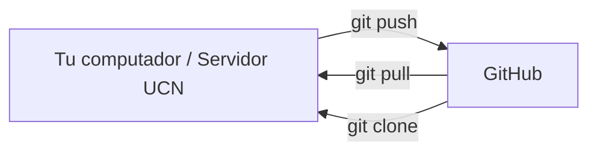
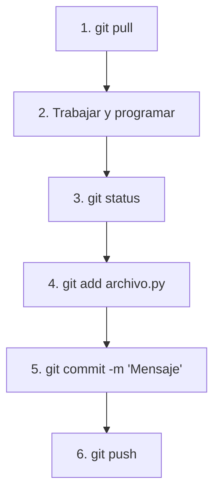

# Guía 01 — Git y GitHub

> **Objetivo:** conectar tu computador o servidor con GitHub y aprender el flujo de trabajo para colaborar en los laboratorios de Machine Learning.

Esta guía asume que ya conoces los comandos básicos locales vistos en la **[Guía 00 — Git Básico](./00-git-basico.md)**.

---

## 0. Git vs GitHub

- **Git:** es el programa que controla las versiones en tu computador o en el servidor.
- **GitHub:** es la plataforma en la nube donde guardas tu repositorio para respaldarlo y trabajar en equipo.



---

## 1. Conectarte a GitHub (HTTPS)

En el curso usamos URLs **HTTPS** (`https://github.com/usuario/repo.git`).

* **Bajar** un repositorio público (`git clone`) no pide cuenta.
* **Subir** cambios (`git push`) o usar un repo **privado** sí pide identificarte. La contraseña de la web de GitHub **no funciona** en la terminal.

Elige según dónde estés trabajando:

| Dónde | Cómo identificarte (una vez) |
| :--- | :--- |
| **Tu computador** (Windows, macOS o Linux) | Ventana **Connect to GitHub** → iniciar sesión en el navegador |
| **Servidor UCN** | Personal Access Token (se pega cuando la terminal pide *Password*) |

---

### 1.1 En tu computador (Windows, macOS, Linux)

1. Clona el repositorio o entra a la carpeta del proyecto.
2. Cuando subas por primera vez (`git push`), Git abre **Connect to GitHub**.
3. Elige **Sign in with your browser**, inicia sesión en GitHub y autoriza el acceso (incluye 2FA si lo tienes).
4. Vuelve a la terminal: el `push` debería terminar solo. La sesión queda guardada en el sistema (Windows Credential Manager, llavero de macOS, o el almacén de Linux).

No hace falta crear un token en el computador personal si esa ventana aparece.

| Sistema | Qué esperar |
| :--- | :--- |
| **Windows** | Git for Windows trae Git Credential Manager. Al primer `push` abre el navegador. |
| **macOS** | Igual, con Git reciente. Si no abre nada: `brew install --cask git-credential-manager`. |
| **Linux** | Puede abrir el navegador (si hay GCM) o pedir usuario y token en la terminal. En ese caso usa la sección 1.2. |

Si la ventana ofrece pegar un **Token** en vez del navegador, también sirve (sección 1.2).

---

### 1.2 En el servidor UCN (token)

En el servidor no conviene depender del navegador. Se crea un **Personal Access Token** desde tu computador, en [github.com](https://github.com/):

1. Foto de perfil → **Settings**.
2. Al final del menú izquierdo: **Developer settings** (en algunas cuentas aparece **Credentials**).
3. **Personal access tokens** → **Tokens (classic)**.
4. **Generate new token** → **Generate new token (classic)**.
5. **Note:** un nombre (ej. `servidor-ucn`).
6. **Expiration:** 90 días o la que prefieras.
7. Marca la casilla **`repo`**.
8. **Generate token** y cópialo de inmediato (GitHub no lo vuelve a mostrar).

En la terminal del servidor, cuando Git pida credenciales:

* **Username:** tu usuario de GitHub.
* **Password:** el token (no la contraseña de la web).

Para no pegarlo en cada `push`:

```bash
git config --global credential.helper store
```

Git guardará usuario y token en `~/.git-credentials` (solo en **tu** home del servidor). No uses este comando en un computador compartido del laboratorio.

El mismo token sirve si en tu PC Linux te pide usuario/contraseña en vez de abrir el navegador.

---

### 1.3 Si el `push` sigue fallando

* No eres dueño del repo y nadie te agregó en **Settings → Collaborators**.
* En Windows, borra credenciales viejas: Panel de control → Administrador de credenciales → entradas de `github.com`.
* El token expiró o se pegó con un espacio → genera uno nuevo.

---

## 2. Empezar a trabajar con un repositorio

Los repos del curso son **públicos**: clonar no pide cuenta. Subir cambios (`git push`) sí pide identificarte (sección 1).

---

### Opción A: Fork del laboratorio del profesor *(lo habitual en el curso)*

El profesor publica un repo con el código a medias. Ese repo **no es tuyo**: si lo clonas, `git push` falla.

1. Entra al repositorio del profesor en GitHub.
2. Arriba a la derecha: **Fork** → **Create fork**. En grupo, **un solo fork** (el de un integrante).
3. Clona **tu fork** (mira que la URL tenga *tu* usuario, no el del profesor):

```bash
git clone https://github.com/tu-usuario/nombre-laboratorio.git
cd nombre-laboratorio
```

4. En grupo: en **tu fork**, **Settings → Collaborators → Add people**.

Si el profesor actualiza el original y quieres esos cambios:

```bash
git remote add upstream https://github.com/profe/nombre-laboratorio.git   # una vez
git fetch upstream
git merge upstream/main
```

---

### Opción B: Crear un proyecto nuevo desde cero *(inducción o repo propio)*
La forma más sencilla es crearlo primero en GitHub y luego clonarlo:

1. En GitHub, haz clic en el botón **New** (o [github.com/new](https://github.com/new)).
2. Escribe el nombre del repositorio (ej: `laboratorio-01-ml`).
3. Marca la casilla **Add a README file**.
4. Haz clic en **Create repository**.
5. Copia el enlace HTTPS del repositorio y clónalo en tu terminal:

```bash
git clone https://github.com/usuario/laboratorio-01-ml.git
cd laboratorio-01-ml
```

> **¿Por qué este camino es el mejor?** 
> Al crearlo en GitHub y clonarlo, el repositorio **ya queda configurado, enlazado y listo para usar**. No necesitas memorizar comandos como `git init`, `git branch -M main` ni `git remote add origin`.

*(Si ya tenías una carpeta creada en tu computador y quieres conectarla manualmente a GitHub, puedes hacerlo con `git init`, `git remote add origin URL` y `git push -u origin main`).*

---

## 3. El flujo de trabajo diario

Este es el ciclo que usarás en todas las sesiones de laboratorio:



1. **`git pull`**: Descarga los últimos cambios que subieron tus compañeros.
2. **Programar:** Editas tus scripts y realizas experimentos.
3. **`git status`**: Revisas qué archivos modificaste.
4. **`git add archivo.py`**: Preparas los archivos que quieres guardar.
5. **`git commit -m "Descripción clara"`**: Guardas una versión con un mensaje descriptivo.
6. **`git push`**: Sube tus commits a GitHub. La primera vez en esa máquina te pedirá identificarte (sección 1).

---

## 4. Trabajo en equipo (Grupos de 2 a 3 personas)

### 4.1 Invitar a tus compañeros al repositorio
1. Un integrante hace el **fork** (opción A) o crea el repo.
2. En **ese** repo: **Settings → Collaborators → Add people**.
3. Los compañeros aceptan la invitación (correo o el enlace del repo).

### 4.2 Reglas para evitar problemas
* **Regla #1:** Haz `git pull` **siempre** antes de empezar a escribir código.
* **Regla #2:** Modularicen su código en archivos `.py` dentro de una carpeta `src/` (por ejemplo `src/preprocessing.py`, `src/models.py`).
* **Regla #3 con Notebooks (`.ipynb`):** No editen el mismo notebook al mismo tiempo. Los archivos `.ipynb` son difíciles de mezclar si dos personas tocan la misma celda. Limpien las salidas (*Clear All Outputs*) antes de hacer commit.

---

## 5. Resolver un conflicto simple

Un conflicto ocurre si dos personas modificaron la misma línea de un archivo y Git no sabe cuál conservar.

Al hacer `git pull`, Git te avisará:

```text
CONFLICT (content): Merge conflict in src/modelos.py
```

Abre el archivo en VS Code o en tu editor. Verás marcas como esta:

```text
<<<<<<< HEAD
Tu cambio local
=======
El cambio que subió tu compañero
>>>>>>> main
```

1. Elige el código correcto con tu equipo.
2. Borra las líneas de marcas (`<<<<<<<`, `=======`, `>>>>>>>`).
3. Guarda el archivo.
4. Registra la solución:
   ```bash
   git add src/modelos.py
   git commit -m "Resolver conflicto en modelos"
   git push
   ```

---

## 6. LazyGit (Opcional)

LazyGit es una interfaz visual dentro de la terminal que te permite hacer `add`, `commit` y `push` presionando teclas sencillas.

### 6.1 Instalar en el servidor Ubuntu (sin `sudo`)
```bash
mkdir -p ~/.local/bin
cd /tmp
curl -L -o lazygit.tar.gz https://github.com/jesseduffield/lazygit/releases/download/v0.64.1/lazygit_0.64.1_linux_x86_64.tar.gz
tar -xzf lazygit.tar.gz
mv lazygit ~/.local/bin/
chmod +x ~/.local/bin/lazygit
echo 'export PATH="$HOME/.local/bin:$PATH"' >> ~/.bashrc
source ~/.bashrc
```

### 6.2 Usar LazyGit
Entra a tu repositorio y ejecuta:

```bash
lazygit
```

* `Espacio`: Seleccionar archivo (*git add*)
* `c`: Escribir commit
* `P` (Mayúscula): Subir cambios (*git push*)
* `p` (Minúscula): Descargar cambios (*git pull*)
* `q`: Salir

---

## 7. Datasets y resultados grandes

**GitHub no está hecho para guardar datos gigantes ni modelos pesados.**

* **GitHub guarda:** Código, scripts, notebooks limpios y configuraciones.
* **Tu computador / Servidor guarda:** Datasets grandes, imágenes o carpetas de datos, archivos `.parquet`, `.pkl` o `.joblib`.

Para mover datasets o descargar los modelos y figuras generadas en el servidor a tu computador, lo hacemos visualmente desde **VS Code Remote** (clic derecho → *Download*), como se explica en la **[Guía 02 — Servidor y Entornos Conda](./02-servidor-conda.md)**.

---

## 8. Errores frecuentes

| Error | Causa | Solución |
| :--- | :--- | :--- |
| `fatal: not a git repository` | Estás fuera de la carpeta del proyecto. | Usa `cd nombre-carpeta` para entrar al repo. |
| `Authentication failed` | No hay sesión, el token expiró o se copió con espacios. | En el PC: inicia sesión en la ventana **Connect to GitHub**. En el servidor: token nuevo con permiso `repo`. |
| Aparece **Connect to GitHub** al hacer `push` | Git Credential Manager pide iniciar sesión. Es lo esperado. | **Sign in with your browser**. No es un error. |
| `rejected (non-fast-forward)` | Hay cambios en GitHub que no tienes en tu máquina. | Ejecuta `git pull` antes de hacer `push`. |
| `Permission denied` / no puedes hacer `push` | Clonaste el repo del profesor, no tu fork. | Haz fork, clona **tu** URL, o agrega `git remote set-url origin https://github.com/tu-usuario/repo.git`. |

---

## 9. Referencia rápida

| Comando | Para qué sirve |
| --- | --- |
| `git clone https://github.com/...` | Descargar un repositorio. En labs: clona **tu fork**, no el del profesor |
| `git pull` | Descargar e integrar los cambios de GitHub (privado: con sesión) |
| `git push` | Subir commits; **siempre** pide estar autenticado |
| `git status` | Ver qué archivos has modificado |
| `git add archivo` | Preparar un archivo para guardar |
| `git commit -m "mensaje"` | Guardar una nueva versión en el historial |
| `git push` | Subir tus commits a GitHub |
| `git remote -v` | Ver a qué URL remota está conectado el repo |
| `lazygit` | Abrir la interfaz interactiva en la terminal |
