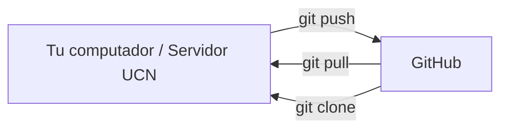
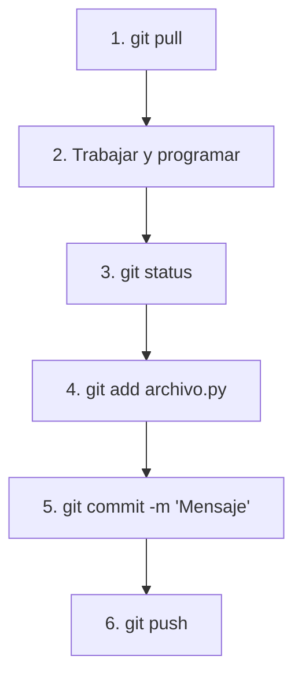

# Guía 01 — Git y GitHub

> **Objetivo:** conectar tu computador o servidor con GitHub y aprender el flujo de trabajo para colaborar en los laboratorios de Machine Learning.

Esta guía asume que ya conoces los comandos básicos locales vistos en la **[Guía 00 — Git Básico](./00-git-basico.md)**.

---

## 0. Git vs GitHub

- **Git:** es el programa que controla las versiones en tu computador o en el servidor.
- **GitHub:** es la plataforma en la nube donde guardas tu repositorio para respaldarlo y trabajar en equipo.



---

## 1. Autenticación con GitHub (Token de acceso)

Cuando usas GitHub desde la terminal con enlaces HTTPS (`https://github.com/...`), tu contraseña normal de inicio de sesión no funciona por motivos de seguridad. En su lugar, debes generar un **Personal Access Token (PAT)** que sirve como contraseña para la terminal.

### 1.1 Crear tu Token en GitHub (Se hace una sola vez)

1. Entra a [GitHub.com](https://github.com/) e inicia sesión en el navegador.
2. Haz clic en tu foto de perfil (arriba a la derecha) → **Settings**.
3. Baja hasta el final del menú izquierdo y haz clic en **Developer settings (o Credentials)**.
4. Selecciona **Personal access tokens** → **Tokens (classic)**.
5. Haz clic en **Generate new token** → **Generate new token (classic)**.
6. En **Note**, escribe un nombre que recuerdes (ej: `servidor-ucn` o `mi-laptop`).
7. En **Expiration**, elige el tiempo de duración que prefieras (ej. 90 días o Sin expiración).
8. Marca la casilla **`repo`** (esto da permisos para subir y bajar código).
9. Haz clic en el botón verde **Generate token** al final de la página.
10. **Copia el token inmediatamente.** *(GitHub solo te lo mostrará esta vez. Guárdalo en un bloc de notas seguro).*

> **Tip para no escribir el Token cada vez:**
> Ejecuta este comando en tu terminal una sola vez:
> ```bash
> git config --global credential.helper store
> ```
> Con esto, Git recordará tu usuario y token después de la primera vez que lo ingreses, y no te lo volverá a pedir.
> *(Nota de seguridad: este comando guarda el token en texto plano en `~/.git-credentials`. Es ideal para tu computador personal o tu cuenta privada en el servidor, pero si compartes cuenta en un equipo de acceso público, usa autenticación mediante llaves SSH).*

---

## 2. Empezar a trabajar con un repositorio

Hay dos situaciones comunes al iniciar un laboratorio:

---

### Opción A: Clonar un laboratorio ya existente
Si el profesor o tu equipo ya crearon el repositorio:

1. Entra al repositorio en GitHub.
2. Haz clic en el botón verde **<> Code** y copia el enlace **HTTPS** (`https://github.com/usuario/nombre-laboratorio.git`).
3. En tu terminal escribe:

```bash
git clone https://github.com/usuario/nombre-laboratorio.git
cd nombre-laboratorio
```

---

### Opción B: Crear un proyecto nuevo desde cero *(El camino más fácil)*
La forma más sencilla de empezar un proyecto nuevo es crearlo primero en la web de GitHub y luego clonarlo en tu equipo:

1. En GitHub, haz clic en el botón **New** (o [github.com/new](https://github.com/new)).
2. Escribe el nombre del repositorio (ej: `laboratorio-01-ml`).
3. Marca la casilla **Add a README file**.
4. Haz clic en **Create repository**.
5. Copia el enlace HTTPS del repositorio y clónalo en tu terminal:

```bash
git clone https://github.com/usuario/laboratorio-01-ml.git
cd laboratorio-01-ml
```

> **¿Por qué este camino es el mejor?** 
> Al crearlo en GitHub y clonarlo, el repositorio **ya queda configurado, enlazado y listo para usar**. No necesitas memorizar comandos como `git init`, `git branch -M main` ni `git remote add origin`.

*(Si ya tenías una carpeta creada en tu computador y quieres conectarla manualmente a GitHub, puedes hacerlo con `git init`, `git remote add origin URL` y `git push -u origin main`).*

---

## 4. El flujo de trabajo diario

Este es el ciclo que usarás en todas las sesiones de laboratorio:



1. **`git pull`**: Descarga los últimos cambios que subieron tus compañeros.
2. **Programar:** Editas tus scripts y realizas experimentos.
3. **`git status`**: Revisas qué archivos modificaste.
4. **`git add archivo.py`**: Preparas los archivos que quieres guardar.
5. **`git commit -m "Descripción clara"`**: Guardas una versión con un mensaje descriptivo.
6. **`git push`**: Envías tus avances a GitHub.

---

## 5. Trabajo en equipo (Grupos de 2 a 3 personas)

### 5.1 Invitar a tus compañeros al repositorio
1. Un integrante del grupo crea el repositorio en GitHub.
2. Va a la pestaña **Settings** del repositorio → menú izquierdo **Collaborators**.
3. Clic en **Add people** y busca a sus compañeros por usuario de GitHub o correo.
4. Los compañeros aceptan la invitación que les llega al correo o entrando al enlace del repositorio.

### 5.2 Reglas para evitar problemas
* **Regla #1:** Haz `git pull` **siempre** antes de empezar a escribir código.
* **Regla #2:** Modularicen su código en archivos `.py` dentro de una carpeta `src/` (por ejemplo `src/preprocessing.py`, `src/models.py`).
* **Regla #3 con Notebooks (`.ipynb`):** No editen el mismo notebook al mismo tiempo. Los archivos `.ipynb` son difíciles de mezclar si dos personas tocan la misma celda. Limpien las salidas (*Clear All Outputs*) antes de hacer commit.

---

## 6. Resolver un conflicto simple

Un conflicto ocurre si dos personas modificaron la misma línea de un archivo y Git no sabe cuál conservar.

Al hacer `git pull`, Git te avisará:

```text
CONFLICT (content): Merge conflict in src/modelos.py
```

Abre el archivo en VS Code o en tu editor. Verás marcas como esta:

```text
<<<<<<< HEAD
Tu cambio local
=======
El cambio que subió tu compañero
>>>>>>> main
```

1. Elige el código correcto con tu equipo.
2. Borra las líneas de marcas (`<<<<<<<`, `=======`, `>>>>>>>`).
3. Guarda el archivo.
4. Registra la solución:
   ```bash
   git add src/modelos.py
   git commit -m "Resolver conflicto en modelos"
   git push
   ```

---

## 7. LazyGit (Opcional)

LazyGit es una interfaz visual dentro de la terminal que te permite hacer `add`, `commit` y `push` presionando teclas sencillas.

### 7.1 Instalar en el servidor Ubuntu (sin `sudo`)
```bash
mkdir -p ~/.local/bin
cd /tmp
curl -L -o lazygit.tar.gz https://github.com/jesseduffield/lazygit/releases/download/v0.64.1/lazygit_0.64.1_linux_x86_64.tar.gz
tar -xzf lazygit.tar.gz
mv lazygit ~/.local/bin/
chmod +x ~/.local/bin/lazygit
echo 'export PATH="$HOME/.local/bin:$PATH"' >> ~/.bashrc
source ~/.bashrc
```

### 7.2 Usar LazyGit
Entra a tu repositorio y ejecuta:

```bash
lazygit
```

* `Espacio`: Seleccionar archivo (*git add*)
* `c`: Escribir commit
* `P` (Mayúscula): Subir cambios (*git push*)
* `p` (Minúscula): Descargar cambios (*git pull*)
* `q`: Salir

---

## 8. Datasets y resultados grandes con Drive y `rclone` (Opcional)

**GitHub no está hecho para guardar datos gigantes ni modelos pesados.**

* **GitHub guarda:** Código, scripts, notebooks limpios y configuraciones.
* **Google Drive / Servidor guarda:** Datasets grandes, imágenes o carpetas de datos, archivos `.parquet`, `.pkl` o `.joblib`.

Para sincronizar resultados pesados entre el servidor y Google Drive usamos `rclone`:

```bash
# Copiar la carpeta artifacts a Drive sin borrar nada:
rclone copy ./artifacts gdrive:ML-Laboratorios/Lab01/artifacts -P
```

*(La configuración detallada de `rclone` y el servidor se profundiza en la [Guía 02 — Servidor y Entornos Conda](./02-servidor-conda.md)).*

---

## 9. Errores frecuentes

| Error | Causa | Solución |
| :--- | :--- | :--- |
| `fatal: not a git repository` | Estás fuera de la carpeta del proyecto. | Usa `cd nombre-carpeta` para entrar al repo. |
| `Authentication failed` | El token expiró o se copió con espacios. | Genera un nuevo Token en GitHub con permiso `repo`. |
| `rejected (non-fast-forward)` | Hay cambios en GitHub que no tienes en tu máquina. | Ejecuta `git pull` antes de hacer `push`. |

---

## 10. Referencia rápida

| Comando | Para qué sirve |
| --- | --- |
| `git clone https://github.com/...` | Descargar un repositorio a tu máquina |
| `git pull` | Descargar e integrar los cambios de GitHub |
| `git status` | Ver qué archivos has modificado |
| `git add archivo` | Preparar un archivo para guardar |
| `git commit -m "mensaje"` | Guardar una nueva versión en el historial |
| `git push` | Subir tus commits a GitHub |
| `git remote -v` | Ver a qué URL remota está conectado el repo |
| `lazygit` | Abrir la interfaz interactiva en la terminal |
