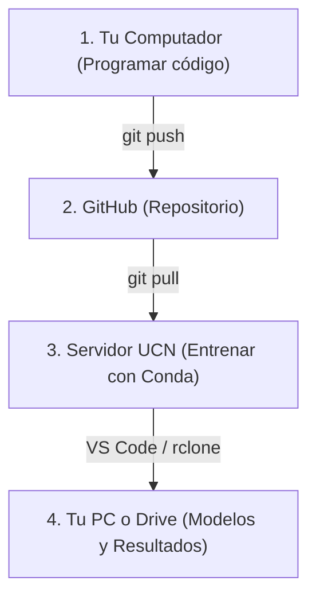
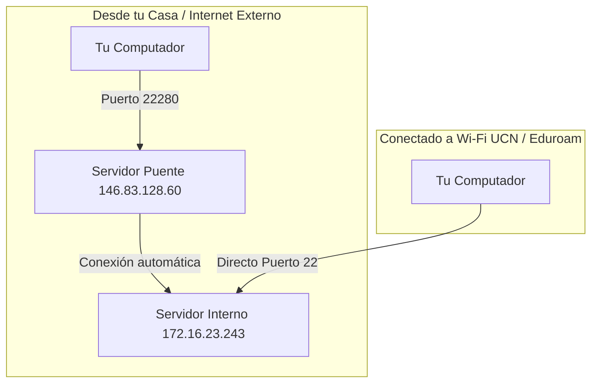

# Guía 02 — Servidor UCN y Entornos Conda

> **Objetivo:** aprender a conectarte al servidor de la universidad (desde la U o desde tu casa), gestionar entornos reproducibles con Conda y ejecutar entrenamientos pesados siguiendo el flujo de trabajo del curso.

Esta guía se complementa con la **[Guía 00 — Git Básico](./00-git-basico.md)** y la **[Guía 01 — Git y GitHub](./01-git-y-github.md)**.

---

## 0. El flujo de trabajo en Machine Learning

En este curso no necesitas programar directamente en la consola del servidor. El flujo estándar es:



1. **En tu computador:** Escribes tu código en VS Code o tu editor habitual y haces `git push` a GitHub.
2. **En el servidor UCN:** Te conectas por SSH, haces `git pull` para descargar tu código, activas el entorno Conda y ejecutas los entrenamientos.
3. **Descargar resultados:** Descargas tus figuras y modelos (`artifacts/`) directamente desde VS Code Remote (clic derecho → *Download*) o los respaldas a Google Drive con `rclone`.

---

## 1. La Red del Servidor UCN

La universidad cuenta con dos máquinas para este servicio:

| Máquina | Dirección IP | Puerto | Uso |
| :--- | :--- | :--- | :--- |
| **Servidor Interno** | `172.16.23.243` | `22` | La máquina donde ejecutas el código y entrenas tus modelos. |
| **Servidor Puente (*Jump Host*)** | `146.83.128.60` | `22280` | La puerta de entrada obligatoria cuando te conectas desde fuera de la U. |



---

---

## 2. Cómo conectarte por SSH (De lo manual a lo automático)

Para conectarte al servidor puedes seguir una progresión de tres niveles, donde cada uno mejora la comodidad del anterior:

---

### 2.1 Nivel 1: Conexión manual por terminal (Básico)

Es la forma directa de conectarte sin configurar nada previo en tu equipo:

#### 1. Si estás dentro de la U (conectado a Wi-Fi UCN o Eduroam):
Te conectas directamente al servidor interno:

```bash
ssh <tu_usuario>@172.16.23.243
```
*(Ingresas tu contraseña de usuario del servidor).*

#### 2. Si estás fuera de la U (desde tu casa o internet móvil):
Te conectas al servidor puente:

```bash
ssh puente@146.83.128.60 -p 22280
```

1. Ingresas la clave del puente.
2. El servidor puente iniciará la conexión con la máquina interna (*"Conectando con la VM interna... Bienvenido"*).
3. Ingresas tu usuario y contraseña de alumno para entrar directamente a tu sesión.

---

### 2.2 Nivel 2: Automatizar la conexión en tu computador (Recomendado)

Para no escribir la dirección IP, puertos ni claves del puente cada vez que quieras conectarte, puedes guardar la configuración de `servidor-ucn` en tu archivo local `~/.ssh/config`.

#### En macOS:

1. Instala `sshpass` con Homebrew (para inyectar la clave del puente automáticamente):
   ```bash
   brew install hudochenkov/sshpass/sshpass
   ```
2. Edita o crea tu archivo `~/.ssh/config`:
   ```bash
   nano ~/.ssh/config
   ```
3. Pega la siguiente configuración:
   ```text
   Host servidor-ucn
       HostName 172.16.23.243
       User <tu_usuario>
       Port 22
       ProxyCommand sshpass -p '<clave_del_puente>' ssh -p 22280 -W %h:%p puente@146.83.128.60
   ```

#### En Ubuntu / Linux:

1. Instala `sshpass`:
   ```bash
   sudo apt install sshpass
   ```
2. Agrega el mismo bloque anterior en tu archivo `~/.ssh/config`.

#### En Windows (PowerShell):

En Windows, OpenSSH viene integrado nativamente.

1. Abre el archivo de configuración en tu carpeta de usuario:
   ```powershell
   notepad C:\Users\$env:USERNAME\.ssh\config
   ```
2. Agrega la regla usando `ProxyJump` nativo:
   ```text
   Host servidor-puente
       HostName 146.83.128.60
       Port 22280
       User puente

   Host servidor-ucn
       HostName 172.16.23.243
       Port 22
       User <tu_usuario>
       ProxyJump servidor-puente
   ```

#### Cómo usarlo:
Una vez guardada esta configuración, ya no necesitas recordar IPs ni puertos. Desde cualquier terminal en tu computador solo escribes:

```bash
ssh servidor-ucn
```

---

### 2.3 Nivel 3: Conexión visual con VS Code Remote - SSH

> **Requisito previo:** Para usar esta función es necesario haber completado el **Nivel 2 (Sección 2.2)**, ya que la extensión de VS Code lee automáticamente los datos de tu archivo `~/.ssh/config` para establecer la conexión.

Si prefieres ver las carpetas y archivos del servidor directamente en la interfaz gráfica de VS Code:

1. En el VS Code de tu computador, instala la extensión oficial **Remote - SSH** (de Microsoft).
2. Presiona `Ctrl+Shift+P` (o `Cmd+Shift+P` en Mac) y escribe:
   ```text
   Remote-SSH: Connect to Host...
   ```
3. Selecciona `servidor-ucn` (aparecerá en la lista gracias a la configuración del paso anterior).
4. Se abrirá una ventana de VS Code conectada directamente al servidor remoto. Puedes abrir tu carpeta de trabajo con **File → Open Folder**.

---

## 3. Gestión de Entornos con Conda (Sin `sudo`)

En el servidor de cómputo no tienes permisos de administrador (`sudo`), por lo que utilizas **Conda** para instalar paquetes de Python de forma aislada dentro de tu carpeta personal.

### 3.1 Comprobar Conda
Una vez dentro del servidor, comprueba si Conda está activo:

```bash
conda --version
```

Si te dice `command not found`, activa el entorno base con:

```bash
source ~/miniconda3/bin/activate
# o bien
source ~/.bashrc
```

---

### 3.2 Crear el entorno del laboratorio con `environment.yml`

Para que todo el grupo tenga exactamente las mismas versiones de librerías, los laboratorios entregan un archivo `environment.yml` (por ejemplo, en el **Lab 01**):

```yaml
name: lab01-ml-2026-02
channels:
  - conda-forge
  - defaults
dependencies:
  - python=3.11
  - pip
  - numpy
  - pandas
  - matplotlib
  - scikit-learn
  - joblib
  - pip:
    - opencv-python-headless
    - streamlit
```

Para crear el entorno completo en el servidor a partir de este archivo, ejecuta:

```bash
conda env create -f environment.yml
```

*(Esto descargará e instalará todas las librerías automáticamente en tu carpeta personal sin pedir `sudo`).*

---

### 3.3 Activar y desactivar el entorno

* **Para activar:**
  ```bash
  conda activate lab01-ml-2026-02
  ```
  *(Verás que la terminal cambia su inicio a `(lab01-ml-2026-02) usuario@servidor:~$`)*.

* **Para desactivar cuando termines:**
  ```bash
  conda deactivate
  ```

---

### 3.4 Comandos útiles de Conda

| Comando | Acción |
| :--- | :--- |
| `conda env list` | Ver todos los entornos creados en tu cuenta |
| `conda list` | Ver todas las librerías instaladas en el entorno activo |
| `conda env remove -n mi-entorno` | Borrar un entorno que ya no uses |

---

## 4. Ejecutar el código del laboratorio en el servidor

Siguiendo el flujo de trabajo:

### 1. Descargar o actualizar tu código en el servidor
Entra a la carpeta de tu repositorio y descarga los últimos cambios que hiciste desde tu computador:

```bash
cd ~/mi-laboratorio
git pull
```

### 2. Activar el entorno y entrenar
```bash
conda activate lab01-ml-2026-02

# Ejecutar el script principal de entrenamiento:
python main.py --dataset-dir "data/"
```

El script procesará los datos, entrenará los clasificadores y guardará los resultados en la carpeta `artifacts/`.

---

### 3. Ejecutar aplicaciones visuales (Streamlit)

Si el laboratorio incluye una interfaz visual con Streamlit (por ejemplo `main_visual.py` o `app.py`):

```bash
streamlit run main_visual.py
```

Al ejecutarlo, Streamlit indicará que está corriendo en el puerto local: `http://localhost:8501`.

#### Cómo ver la aplicación en el navegador de tu computador:
* **Si usas VS Code Remote:** VS Code detecta automáticamente que se abrió el puerto 8501 y te mostrará una notificación: *"Open in Browser"*. Haz clic y se abrirá directamente en tu navegador.
* **Si usas terminal directa:** Puedes hacer un túnel SSH agregando el reenvío de puertos `-L 8501:localhost:8501` al conectarte:
  ```bash
  ssh -L 8501:localhost:8501 servidor-ucn
  ```
  Luego abres `http://localhost:8501` en tu computador.

---

## 5. Descargar artefactos y mover archivos (Dos formas)

Nota: **Los datasets grandes y los modelos binarios (`.pkl`, `.joblib`, `.parquet`) no se suben a GitHub.** Para mover tus figuras, reportes, modelos o datasets entre el servidor y tu computador/nube tienes dos opciones:

---

### Opción A: Directo con VS Code Remote (Visual)

Si estás conectado al servidor mediante la extensión **Remote - SSH** de VS Code:

* **Para descargar archivos o carpetas a tu computador:**
  1. En el panel izquierdo de VS Code (Explorador de archivos), busca el archivo o la carpeta generada (ej: `artifacts/` o `reporte.pdf`).
  2. Haz clic derecho sobre él y selecciona **Download...** (Descargar).
  3. Elige dónde guardarlo en tu computador.

* **Para subir datasets o archivos al servidor:**
  1. Abre la carpeta de destino en el explorador de VS Code.
  2. Arrastra el archivo desde tu explorador de Windows o Finder de Mac y suéltalo dentro de la ventana de VS Code.

---

### Opción B: A la nube con Google Drive y `rclone` (Para respaldos grandes)

Si necesitas respaldar datasets grandes o dejar tus modelos en Google Drive:

#### 5.1 Instalar `rclone` en tu cuenta del servidor (Sin `sudo`)

Pega este bloque en la terminal del servidor:

```bash
mkdir -p ~/.local/bin
cd /tmp
curl -L -o rclone.zip https://downloads.rclone.org/rclone-current-linux-amd64.zip
unzip -o rclone.zip
cp rclone-*-linux-amd64/rclone ~/.local/bin/
chmod +x ~/.local/bin/rclone
echo 'export PATH="$HOME/.local/bin:$PATH"' >> ~/.bashrc
source ~/.bashrc
```

Comprueba la instalación con:

```bash
rclone version
```

---

#### 5.2 Configurar tu Google Drive institucional

En el servidor:

```bash
rclone config
```

1. Escribe `n` para crear un *New remote*.
2. Nombre: `gdrive`
3. Tipo de almacenamiento: escribe `drive` (o el número correspondiente a Google Drive).
4. Deja en blanco *Client ID* y *Client Secret* (presiona **Enter** dos veces).
5. Alcance (*Scope*): elige `1` (acceso completo a Drive).
6. Deja en blanco el *root_folder_id* y *service_account* (presiona **Enter**).
7. En *Edit advanced config*: escribe `n` (No).
8. En *Use auto config*: escribe `n` (No, porque el servidor no tiene navegador gráfico).
9. Te pedirá ejecutar un comando en tu computador personal para autorizar la cuenta institucional de Google. Sigue las instrucciones que aparecen en pantalla.
10. Confirma con `y` y sal con `q`.

---

#### 5.3 Comandos frecuentes de `rclone`

```bash
# 1. Ver qué carpetas tienes en tu Drive:
rclone ls gdrive: --max-depth 1

# 2. Respaldar la carpeta artifacts generada por el entrenamiento a tu Drive:
rclone copy ./artifacts gdrive:ML-Laboratorios/Lab01/artifacts -P

# 3. Descargar un dataset pesado desde Drive al servidor:
rclone copy gdrive:Datasets/datos.zip ./data/ -P
```

> **Importante:** Usa siempre `rclone copy` y evita `rclone sync`. `copy` solo copia archivos nuevos sin borrar nada en el destino; `sync` puede eliminar archivos en Drive si no están en el servidor.

---

## 6. Errores frecuentes y soluciones

| Error / Síntoma | Causa | Solución |
| :--- | :--- | :--- |
| `Connection timed out` al hacer `ssh` | Estás intentando entrar a la IP interna (`172.16.23.243`) desde tu casa sin pasar por el puente. | Usa la conexión a través del servidor puente o la regla en `~/.ssh/config`. |
| `conda: command not found` | El PATH de Conda no se cargó al iniciar la sesión. | Ejecuta `source ~/.bashrc` o `source ~/miniconda3/bin/activate`. |
| `Port 8501 is already in use` en Streamlit | Otro proceso está usando el puerto por defecto. | Lanza Streamlit en otro puerto: `streamlit run main_visual.py --server.port 8505`. |
| `ModuleNotFoundError` al correr scripts | No activaste el entorno Conda correcto. | Ejecuta `conda activate <nombre-del-entorno>` antes de ejecutar tu script. |

---

## 7. Referencia rápida

```bash
# Conectarte al servidor (con ~/.ssh/config configurado)
ssh servidor-ucn

# Actualizar el código que subiste desde tu PC
cd ~/mi-laboratorio
git pull

# Activar el entorno Conda
conda activate lab01-ml-2026-02

# Ejecutar entrenamiento
python main.py

# Ejecutar visualización
streamlit run main_visual.py

# Subir artefactos pesados a Google Drive
rclone copy ./artifacts gdrive:ML-Laboratorios/Lab01/artifacts -P

# Desactivar entorno y salir del servidor
conda deactivate
exit
```
