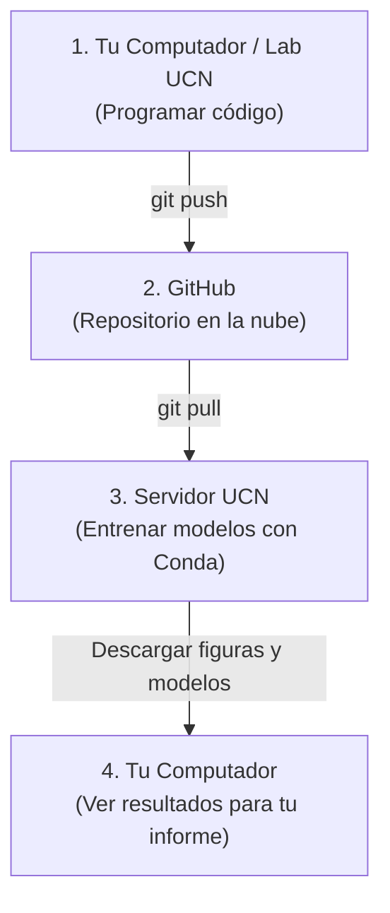
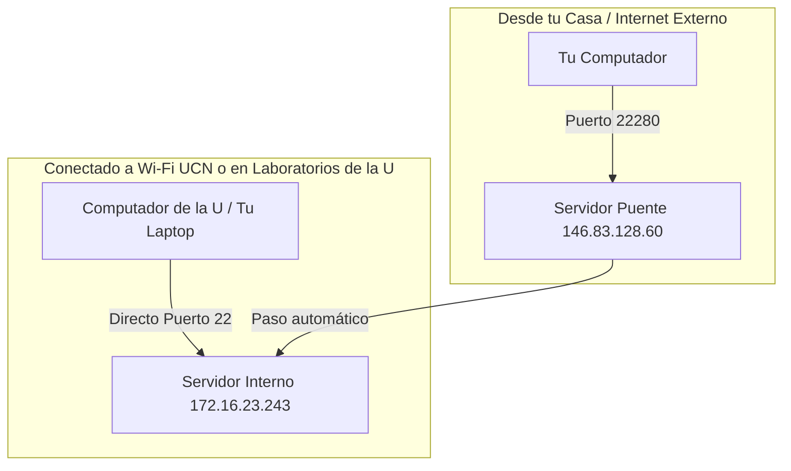

# Guía 02 — Servidor UCN y Entornos Conda

> **Objetivo:** aprender a conectarte al servidor de la universidad (tanto desde los computadores de la U como desde tu casa), utilizar entornos reproducibles con Conda y ejecutar y descargar los resultados de tus laboratorios.

Esta guía se complementa con la **[Guía 00 — Git Básico](./00-git-basico.md)** y la **[Guía 01 — Git y GitHub](./01-git-y-github.md)**.

---

## 0. El flujo de trabajo en 4 pasos

En este curso el flujo de trabajo estándar es muy simple y ordenado:



1. **En tu computador o en el lab de la U:** Escribes tu código y subes tus avances con `git push`.
2. **En el servidor UCN:** Te conectas por SSH, descargas tu código con `git pull`, activas Conda y ejecutas los entrenamientos pesados.
3. **Descargar resultados:** Descargas tus figuras, reportes y modelos (`artifacts/`) a tu computador para incluirlos en el informe.

---

## 1. La Red UCN: ¿Por qué hay dos servidores?

La universidad cuenta con dos máquinas para este servicio:

| Máquina | Dirección IP | Puerto | ¿Para qué sirve? |
| :--- | :--- | :--- | :--- |
| **Servidor Interno** | `172.16.23.243` | `22` | La máquina de cómputo donde están tus archivos, Conda y donde ejecutas tus códigos. |
| **Servidor Puente (*Jump Host*)** | `146.83.128.60` | `22280` | La puerta de entrada obligatoria cuando te conectas **desde tu casa o fuera de la U**. |



---

## 2. Cómo conectarte al Servidor (Elige tu método)

Existen dos formas de conectarte al servidor. Elige la que mejor se adapte a tu situación:

---

### Método 1: Conexión directa por Terminal (Universal — Para computadores de la U o cualquier equipo)

Este método funciona en cualquier computador (laboratorios de la U, PC prestado o tu laptop) sin necesidad de instalar ni configurar nada previo.

Abre la **Terminal** (en macOS/Linux) o **PowerShell** (en Windows) y ejecuta el comando según dónde estés:

#### Caso A: Si estás dentro de la U (Laboratorio de computación o Wi-Fi UCN)
Te conectas directamente a la máquina interna:

```bash
ssh <tu_usuario>@172.16.23.243
```
*(Ejemplo: `ssh gael.ortega@172.16.23.243`).*

1. Si es tu primera vez conectándote desde ese equipo, te preguntará: `Are you sure you want to continue connecting (yes/no)?`. Escribe **`yes`** y presiona Enter.
2. Ingresa tu contraseña de alumno asignada para el servidor.
3. ¡Listo! Verás la bienvenida de Ubuntu en la máquina de cómputo (`usuario@enterprise:~$`).

#### Caso B: Si estás fuera de la U (Desde tu casa o internet móvil)
Debes pasar por el servidor puente usando el puerto `22280`:

```bash
ssh puente@146.83.128.60 -p 22280
```

1. Ingresa la contraseña del usuario `puente`.
2. El servidor puente iniciará la conexión con la máquina interna (*"Conectando con la VM interna... Bienvenido"*).
3. Ingresa tu usuario y contraseña personal de alumno.
4. ¡Listo! Estarás dentro de tu sesión en el servidor.

---

### Método 2: Conexión visual con VS Code Remote (Recomendado para tu Computador Personal)

Si estás trabajando en tu **propio notebook o computador de casa**, puedes usar la extensión **Remote - SSH** de VS Code para explorar carpetas, editar archivos en vivo y descargar resultados con clic derecho.

#### Paso 1: Configurar el atajo en tu computador (Se hace una sola vez)

* **En Windows (PowerShell):**
  1. Crea la carpeta de configuración:
     ```powershell
     New-Item -ItemType Directory -Force $HOME\.ssh
     ```

  2. Crea el archivo `config`:
     ```powershell
     New-Item -ItemType File -Force $HOME\.ssh\config
     ```

  3. Escribe la configuración:
     ```powershell
     @"
     Host servidor-puente
         HostName 146.83.128.60
         Port 22280
         User puente

     Host servidor-ucn
         HostName 172.16.23.243
         Port 22
         User <tu_usuario>
         ProxyJump servidor-puente
     "@ | Set-Content $HOME\.ssh\config
     ```

     *(Reemplaza `<tu_usuario>` por tu usuario de alumno, por ejemplo `gael.ortega`).*

  4. Comprueba que el archivo se creó correctamente:
     ```powershell
     Get-Content $HOME\.ssh\config
     ```

  5. Comprueba que SSH reconoce la configuración:
     ```powershell
     ssh -G servidor-ucn
     ```

     Deberías encontrar valores similares a:
     ```text
     user <tu_usuario>
     hostname 172.16.23.243
     port 22
     proxyjump servidor-puente
     ```

  6. Conéctate al servidor:
     ```powershell
     ssh servidor-ucn
     ```

* **En macOS o Linux (Terminal):**
  1. Abre tu terminal y edita el archivo:
     ```bash
     mkdir -p ~/.ssh
     nano ~/.ssh/config
     ```
  2. Pega la misma configuración de arriba (reemplazando `<tu_usuario>`).
  3. Guarda con `Ctrl + O`, presiona **Enter** y sal con `Ctrl + X`.

#### Paso 2: Conectarte desde VS Code
1. Abre **VS Code** en tu computador e instala la extensión **Remote - SSH** (de Microsoft).
2. Presiona `Ctrl+Shift+P` (o `Cmd+Shift+P` en Mac) y escribe:
   ```text
   Remote-SSH: Connect to Host...
   ```
3. Selecciona **`servidor-ucn`**.
4. Ingresa la contraseña del puente (`puente`) y luego tu contraseña personal de alumno.
5. Se abrirá una ventana conectada al servidor. Ve a **File → Open Folder** y selecciona tu carpeta `/home/<tu_usuario>`.
6. Para abrir la terminal integrada dentro del servidor, usa el atajo ``Ctrl + ` `` o el menú **Terminal → New Terminal**.

---

## 3. Gestión de Entornos con Conda (En el Servidor)

En el servidor de cómputo no tienes permisos de administrador (`sudo`), por lo que usamos **Conda** para crear entornos aislados e instalar las librerías necesarias para cada laboratorio.

> [!NOTE]
> **Recordatorio:** todos los comandos de esta sección se ejecutan **dentro de la terminal del servidor** (ya sea que te hayas conectado por el Método 1 o por el Método 2).

---

### 3.1 Comprobar si Conda está activo
Escribe en la terminal del servidor:

```bash
conda --version
```

Si te sale `command not found`, activa el acceso a Conda ejecutando:

```bash
source ~/.bashrc
```

---

### 3.2 Crear el entorno del laboratorio (Se hace 1 sola vez por lab)

Cada laboratorio incluye un archivo llamado `environment.yml` con la lista de librerías requeridas (como NumPy, Pandas, Scikit-Learn).

Para crear el entorno automáticamente, entra a la carpeta de tu laboratorio y ejecuta:

```bash
conda env create -f environment.yml
```

*(Conda descargará e instalará todas las herramientas necesarias de forma automática en tu cuenta personal).*

---

### 3.3 Activar el entorno para trabajar

Cada vez que vayas a trabajar o correr código, debes activar el entorno correspondiente:

```bash
conda activate lab01-ml-2026-02
```

*(Notarás que el inicio de tu terminal cambia para mostrar el entorno activo: `(lab01-ml-2026-02) usuario@enterprise:~$`).*

* **Para salir del entorno cuando termines:**
  ```bash
  conda deactivate
  ```

---

### 3.4 Comandos útiles de Conda

| Comando | ¿Para qué sirve? |
| :--- | :--- |
| `conda activate <nombre>` | Activar un entorno de trabajo |
| `conda deactivate` | Desactivar el entorno actual |
| `conda env list` | Ver la lista de todos tus entornos creados |
| `conda list` | Ver qué librerías están instaladas en el entorno actual |
| `conda env remove -n <nombre>` | Borrar un entorno que ya no uses para liberar espacio |

---

## 4. Ejecutar tu código y aplicaciones

Siguiendo el flujo del curso, una vez dentro del servidor:

### 4.1 Actualizar tu código desde GitHub

Clona **tu fork** (no el repo del profesor). Detalle en la **[Guía 01](./01-git-y-github.md)**.

```bash
cd ~/mi-laboratorio
git pull
```

### 4.2 Activar el entorno y entrenar tu modelo
```bash
conda activate lab01-ml-2026-02
python main.py
```
*(El script entrenará los clasificadores y guardará los gráficos y modelos resultantes en la carpeta `artifacts/`).*

---

### 4.3 Dejar un entrenamiento corriendo con `tmux`

Si el script tarda mucho, **no lo ejecutes en la terminal normal**. Si se cae el Wi-Fi, cierras el notebook o se corta el SSH, el proceso muere.

`tmux` crea una sesión en el servidor que sigue viva aunque te desconectes.

```bash
# Crear (o entrar a) una sesión llamada lab
tmux new -s lab
```

Dentro de esa sesión activas el entorno y lanzas el entrenamiento:

```bash
conda activate lab01-ml-2026-02
python main.py
```

| Acción | Cómo |
| :--- | :--- |
| **Salir sin matar el proceso** | `Ctrl + B`, suelta, luego `D` (*detach*) |
| **Volver a la sesión** | `tmux attach -t lab` |
| **Ver sesiones abiertas** | `tmux ls` |
| **Cerrar la sesión** (cuando ya terminó) | `exit` dentro de tmux, o `tmux kill-session -t lab` |

Puedes desconectarte del servidor (`exit` del SSH) y el entrenamiento sigue. Al reconectarte:

```bash
ssh servidor-ucn
tmux attach -t lab
```

> Si al hacer `attach` te dice que no hay sesión, el proceso ya terminó o la sesión se llama distinto. Revisa con `tmux ls`.

---

### 4.4 Ejecutar aplicaciones visuales (Streamlit)

Si el laboratorio incluye una interfaz interactiva en Streamlit (ej. `app.py` o `main_visual.py`):

```bash
streamlit run app.py
```

* **Si estás usando VS Code Remote (Método 2):** VS Code detectará automáticamente la aplicación y te mostrará una notificación abajo a la derecha: *"Open in Browser"*. Haz clic en ese botón y se abrirá en tu navegador.
* **Para detener la aplicación:** Presiona `Ctrl + C` en la terminal.

---

## 5. Descargar tus resultados a tu Computador

> [!IMPORTANT]
> **Los modelos pesados (`.joblib`, `.pkl`) y datasets grandes nunca se suben a GitHub.** Para tenerlos en tu computador y agregarlos a tu informe, descárgalos usando la opción correspondiente a cómo te conectaste:

---

### 5.1 Si te conectaste por Terminal Directa (Método 1 — Ej. en computadores de la U):
Puedes usar el comando `scp` (*Secure Copy*) desde una **terminal local de tu computador** (no dentro de la sesión del servidor):

1. Abre una nueva ventana de terminal en el computador donde estás sentado.
2. Ejecuta según tu ubicación:

* **Si estás en la U (conectado a Wi-Fi UCN o lab):**
  ```bash
  # Para descargar un archivo específico (ej: una figura generada):
  scp <tu_usuario>@172.16.23.243:~/mi-laboratorio/artifacts/matriz_confusion.png .

  # Para descargar toda la carpeta artifacts completa:
  scp -r <tu_usuario>@172.16.23.243:~/mi-laboratorio/artifacts ./artifacts
  ```

* **Si estás en tu casa o fuera de la U:**
  * **Con el atajo `servidor-ucn` (Recomendado):**
    ```bash
    # Para descargar un archivo específico:
    scp servidor-ucn:~/mi-laboratorio/artifacts/matriz_confusion.png .

    # Para descargar toda la carpeta artifacts completa:
    scp -r servidor-ucn:~/mi-laboratorio/artifacts ./artifacts
    ```

  * **Con la IP directa del puente (si no tienes el archivo config):**
    ```bash
    # Para descargar un archivo específico:
    scp -J puente@146.83.128.60:22280 <tu_usuario>@172.16.23.243:~/mi-laboratorio/artifacts/matriz_confusion.png .

    # Para descargar toda la carpeta artifacts completa:
    scp -r -J puente@146.83.128.60:22280 <tu_usuario>@172.16.23.243:~/mi-laboratorio/artifacts ./artifacts
    ```
*(Ingresas tus contraseñas y los archivos se descargarán directamente a la carpeta donde abriste la terminal).*

---

### 5.2 Si te conectaste con VS Code Remote (Método 2):
Esta es la forma visual si estás trabajando en tu laptop personal:
1. En el panel izquierdo de VS Code (**Explorador de archivos**), abre tu carpeta de trabajo.
2. Busca la carpeta `artifacts/` o el archivo que quieras descargar (por ejemplo `confusion_matrix.png` o `modelo.joblib`).
3. Haz **clic derecho** sobre él y selecciona **Download...** (Descargar).
4. Elige dónde guardarlo en tu computador.

```text
Explorador de VS Code Remote
└── mi-laboratorio/
    ├── src/
    ├── artifacts/
    │   ├── modelo.joblib        ──> [Clic derecho → Download...] ──> Se guarda en tu PC
    │   └── matriz_confusion.png ──> [Clic derecho → Download...] ──> Se guarda en tu PC
    └── main.py
```

*(También puedes subir archivos o datasets al servidor simplemente arrastrándolos desde tu explorador de Windows o Mac hacia el panel de VS Code Remote).*

---

## 6. Errores frecuentes y soluciones rápidas

| Síntoma / Error | Causa habitual | Solución |
| :--- | :--- | :--- |
| `Connection timed out` al hacer SSH | Estás intentando entrar a la IP interna (`172.16.23.243`) desde tu casa sin pasar por el puente. | Desde tu casa conéctate a `puente@146.83.128.60 -p 22280` o usa el atajo `servidor-ucn`. |
| `Permission denied (publickey,password)` | El usuario o la contraseña se ingresaron incorrectamente. | Verifica que tu usuario esté bien escrito (ej: `nombre.apellido`) y vuelve a escribir la clave con cuidado. |
| `Could not resolve hostname servidor-ucn` | El archivo `config` en tu PC no existe o se guardó como `config.txt`. | En PowerShell ejecuta `Rename-Item $HOME\.ssh\config.txt config`. |
| `conda: command not found` | No se cargó la configuración de Conda al iniciar sesión. | Ejecuta `source ~/.bashrc` en la terminal del servidor. |
| `ModuleNotFoundError: No module named 'sklearn'` | Estás ejecutando el script sin activar el entorno del lab. | Ejecuta `conda activate <nombre-del-entorno>` antes de correr tu script. |
| `Port 8501 is already in use` al correr Streamlit | Otro proceso dejó ocupado el puerto por defecto. | Corre Streamlit en otro puerto: `streamlit run app.py --server.port 8505`. |
| Se cortó el SSH y el entrenamiento se detuvo | El proceso corría en la terminal normal, no en `tmux`. | Lanza entrenamientos largos con `tmux new -s lab` y sal con `Ctrl+B` y luego `D`. |

---

## 7. Referencia rápida (Cheatsheet)

### Flujo habitual en la universidad (Lab de computación):
```bash
# 1. Conectarte directo
ssh <tu_usuario>@172.16.23.243

# 2. Ir a tu carpeta y actualizar código
cd ~/mi-laboratorio
git pull

# 3. Activar entorno y ejecutar (si tarda, usa tmux: tmux new -s lab)
conda activate lab01-ml-2026-02
python main.py

# 4. Salir
conda deactivate
exit
```

### Flujo habitual desde tu casa (Terminal directa):
```bash
# 1. Conectarte por el puente
ssh puente@146.83.128.60 -p 22280

# 2. Seguir los mismos pasos de trabajo (git pull, conda activate, python main.py)
```

### Entrenamiento largo (para que no se corte al desconectarte):
```bash
tmux new -s lab          # crear sesión
# ... conda activate y python main.py ...
# Ctrl+B, luego D        # salir sin matar el proceso
tmux attach -t lab       # volver después
```

---

## 8. Opciones avanzadas (Opcional)

<details>
<summary><b>Haz clic aquí si quieres configurar acceso 100% automático sin contraseñas</b></summary>

### Conexión 100% directa sin contraseñas (Claves SSH y Automatización)
Si estás en tu computador personal de confianza y quieres conectarte en 1 solo paso sin tener que escribir nunca más contraseñas personales ni la del puente:

> [!NOTE]
> **Requisito previo:** asegúrate de haber configurado tu archivo `config` con el atajo `servidor-ucn` siguiendo el **Paso 1 del Método 2** (más arriba en esta guía).

#### Paso 1: Generar tu par de claves SSH en tu computador
```bash
ssh-keygen -t ed25519
```
*(Presiona **Enter** tres veces para aceptar las opciones por defecto).*

#### Paso 2: Autorizar tu clave pública en tu cuenta de cómputo (`servidor-ucn`)
* **En Windows (PowerShell):**
  ```powershell
  Get-Content $HOME\.ssh\id_ed25519.pub | ssh servidor-ucn "mkdir -p ~/.ssh && chmod 700 ~/.ssh && cat >> ~/.ssh/authorized_keys && chmod 600 ~/.ssh/authorized_keys"
  ```

* **En macOS y Linux (Terminal):**
  ```bash
  ssh-copy-id servidor-ucn
  ```

*(Te pedirá las contraseñas una última vez para registrar la clave pública).*

---

#### Paso 3: Automatizar la contraseña del servidor puente

Para que el sistema responda automáticamente la clave genérica del puente en segundo plano:

* **En Windows (PowerShell):**
  1. Crea el script asistente de contraseña:
     ```powershell
     Set-Content -Path "$HOME\.ssh\askpass.cmd" -Value '@echo <clave_del_puente>'
     ```
     *(Reemplaza `<clave_del_puente>` por la clave asignada para el usuario `puente`)*.

  2. Activa la variable de entorno en tu usuario de Windows:
     ```powershell
     [Environment]::SetEnvironmentVariable("SSH_ASKPASS", "$HOME\.ssh\askpass.cmd", "User")
     [Environment]::SetEnvironmentVariable("SSH_ASKPASS_REQUIRE", "force", "User")
     $env:SSH_ASKPASS = "$HOME\.ssh\askpass.cmd"
     $env:SSH_ASKPASS_REQUIRE = "force"
     ```

* **En macOS y Linux (Terminal):**
  1. Instala `sshpass` (en macOS: `brew install hudochenkov/sshpass/sshpass` o en Ubuntu: `sudo apt install sshpass`).
  2. En tu archivo `~/.ssh/config`, actualiza la entrada `servidor-ucn` para usar `ProxyCommand`:
     ```ssh
     Host servidor-ucn
         HostName 172.16.23.243
         Port 22
         User <tu_usuario>
         IdentityFile ~/.ssh/id_ed25519
         ProxyCommand sshpass -p '<clave_del_puente>' ssh -p 22280 -W %h:%p puente@146.83.128.60
     ```

---

¡Listo! A partir de este momento, tanto `ssh servidor-ucn` como **VS Code Remote** se conectarán directamente en 1 clic sin solicitar ninguna contraseña.

</details>
