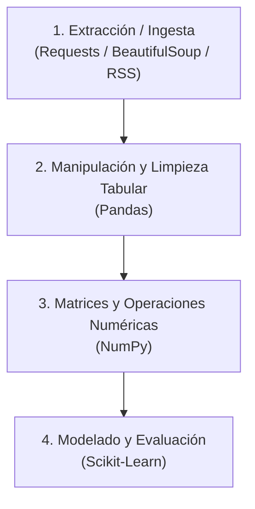

# Guía 03 — Nivelación Python para Data Science

> **Objetivo:** dominar las estructuras y operaciones esenciales de Python, NumPy, Pandas y extracción básica de datos (web scraping y RSS) requeridas para la preparación de datos y el entrenamiento de modelos de Machine Learning.

Esta guía se complementa con la **[Guía 00 — Git Básico](./00-git-basico.md)**, la **[Guía 01 — Git y GitHub](./01-git-y-github.md)** y la **[Guía 02 — Servidor y Conda](./02-servidor-conda.md)**.

---

## 0. El ecosistema básico de Machine Learning en Python

En ciencia de datos y aprendizaje automático trabajamos principalmente con cuatro componentes interconectados:



* **NumPy:** provee estructuras multidimensionales eficientes (*ndarrays*) y operaciones de álgebra lineal vectorizadas.
* **Pandas:** facilita la carga, inspección, filtrado y limpieza de datos estructurados en tablas (*DataFrames*).
* **Scikit-Learn:** consume matrices de NumPy y DataFrames de Pandas para entrenar y evaluar algoritmos de aprendizaje.
* **Requests / BeautifulSoup / Feedparser:** permiten capturar información desde la web o fuentes de noticias para construir un conjunto de datos propio.

---

## 1. Fundamentos de Python aplicados a ML

### 1.1 List Comprehensions (Comprensión de listas)
Permiten transformar y filtrar listas de datos o nombres de archivos en una sola línea legible y eficiente:

```python
# Ejemplo 1: Limpieza rápida de textos
textos = ["  Machine Learning  ", " DATA SCIENCE ", "python  "]
textos_limpios = [t.strip().lower() for t in textos]
# Resultado: ['machine learning', 'data science', 'python']

# Ejemplo 2: Filtrar solo imágenes válidas de una lista de archivos
archivos = ["foto1.jpg", "datos.csv", "foto2.png", "reporte.pdf"]
imagenes = [f for f in archivos if f.endswith((".jpg", ".png"))]
# Resultado: ['foto1.jpg', 'foto2.png']
```

---

### 1.2 Diccionarios para mapeos de clases
En Machine Learning las etiquetas categóricas suelen convertirse a valores numéricos enteros:

```python
# Mapeo de categorías a números
mapa_clases = {"benigno": 0, "maligno": 1}
etiquetas_texto = ["benigno", "maligno", "benigno", "maligno"]

# Conversión usando comprensión de listas
y = [mapa_clases[e] for e in etiquetas_texto]
# Resultado: [0, 1, 0, 1]
```

---

### 1.3 Funciones Lambda
Son funciones anónimas de una sola línea, muy utilizadas dentro de Pandas para transformar columnas:

```python
# Función tradicional
def extraer_anio(fecha_str):
    return int(fecha_str.split("-")[0])

# Equivalente con lambda
extraer_anio_lambda = lambda fecha_str: int(fecha_str.split("-")[0])

print(extraer_anio_lambda("2026-04-15"))  # Salida: 2026
```

---

## 2. NumPy: Arreglos y Cálculo Matricial

NumPy es la base sobre la que operan casi todos los algoritmos de Machine Learning.

```python
import numpy as np
```

### 2.1 Creación e inspección de arreglos

```python
# Vector (1D)
v = np.array([1.5, 2.0, 3.8, 4.2])

# Matriz (2D)
M = np.array([
    [1, 2, 3],
    [4, 5, 6],
    [7, 8, 9]
])

# Arreglos de ceros, unos o rangos
ceros = np.zeros((3, 2))       # Matriz de 3 filas y 2 columnas con ceros
unos = np.ones((4, 4))         # Matriz de 4x4 con unos
secuencia = np.arange(0, 10, 2) # [0, 2, 4, 6, 8]
```

#### Propiedades clave:
```python
print(M.shape)  # Dimensiones: (3, 3) -> (filas, columnas)
print(M.ndim)   # Número de dimensiones: 2
print(M.dtype)  # Tipo de dato: int64 o float64
```

---

### 2.2 Indexación y Slicing (Rebanado)

En Machine Learning se usa constantemente la sintaxis `[filas, columnas]`:

```python
# Matriz de ejemplo (5 muestras, 4 atributos)
X = np.array([
    [10, 20, 30, 1],
    [11, 21, 31, 0],
    [12, 22, 32, 1],
    [13, 23, 33, 0],
    [14, 24, 34, 1]
])

# Obtener una fila completa (ej. la primera muestra)
primera_fila = X[0, :]      # [10, 20, 30, 1]

# Obtener una columna completa (ej. la última columna)
ultima_columna = X[:, -1]   # [1, 0, 1, 0, 1]

# Separar características (todas las columnas excepto la última) y etiquetas
caracteristicas = X[:, :-1] # Matriz de 5x3
etiquetas = X[:, -1]        # Vector de 5 elementos
```

---

### 2.3 Operaciones vectorizadas y Producto Matricial

A diferencia de las listas tradicionales de Python, las operaciones en NumPy se ejecutan de forma vectorizada (sin bucles `for`):

```python
a = np.array([1, 2, 3])
b = np.array([10, 20, 30])

# Operaciones elemento a elemento
print(a + b)   # [11, 22, 33]
print(a * b)   # [10, 40, 90]
print(a ** 2)  # [1, 4, 9]

# Producto punto (dot product) y producto matricial (@)
producto_punto = np.dot(a, b)  # 1*10 + 2*20 + 3*30 = 140

A = np.array([[1, 2], [3, 4]])
B = np.array([[5, 6], [7, 8]])
C = A @ B  # Multiplicación matricial estándar
```

---

### 2.4 Reshape y dimensiones (Evitar errores en Scikit-Learn)

Scikit-Learn exige que la matriz de datos $X$ sea **bidimensional** `(n_muestras, n_atributos)`.

```python
vector = np.array([10, 20, 30, 40])
print(vector.shape)  # (4,) -> Unidimensional (1D)
```

#### ¿Qué significa la coma en `(4,)`?
En Python, una tupla de un solo elemento se escribe con una coma al final `(4,)` para diferenciarla de un simple número entre paréntesis `(4)`. Significa que el arreglo tiene **1 sola dimensión con 4 elementos** (un vector plano).

| Forma (*shape*) | Qué representa | Estructura en datos |
| :--- | :--- | :--- |
| **`(4,)`** | **Vector plano 1D:** No tiene filas ni columnas separadas. | `[10, 20, 30, 40]` |
| **`(4, 1)`** | **Matriz 2D:** 4 filas y 1 columna (formato columna). | `[[10], [20], [30], [40]]` |
| **`(1, 4)`** | **Matriz 2D:** 1 fila y 4 columnas (formato fila). | `[[10, 20, 30, 40]]` |

#### Conversión de dimensiones con `reshape`:
```python
# Convertir vector plano (4,) a matriz 2D (4 muestras, 1 atributo)
matriz_col = vector.reshape(-1, 1)
print(matriz_col.shape)  # (4, 1) -> Aceptado por Scikit-Learn

# Aplanar una matriz 2D a un vector plano 1D
plano = matriz_col.flatten()
print(plano.shape)  # (4,) -> Ideal para vector objetivo 'y'
```

---

## 3. Pandas: Manipulación y Limpieza Tabular

Pandas organiza los datos en **Series** (columnas individuales) y **DataFrames** (tablas bidimensionales con nombres de columnas e índices).

```python
import pandas as pd
```

### 3.1 Cargar y guardar datos

```python
# Cargar desde CSV
df = pd.read_csv("data/dataset.csv")

# Cargar desde formato binario eficiente (Parquet)
df_parquet = pd.read_parquet("data/corpus.parquet")

# Guardar DataFrame limpio
df.to_csv("data/datos_limpios.csv", index=False)
df.to_parquet("data/datos_limpios.parquet", index=False)
```

---

### 3.2 Exploración inicial de un DataFrame

Antes de modelar, es obligatorio inspeccionar la estructura y calidad de la tabla:

```python
# Primeras y últimas filas
df.head(5)
df.tail(3)

# Dimensiones
print(df.shape)  # (filas, columnas)

# Resumen técnico (tipos de datos, columnas y memoria)
df.info()

# Estadísticas descriptivas de variables numéricas
df.describe()

# Nombres de columnas
print(df.columns.tolist())
```

---

### 3.3 Selección y Filtrado Booleano

```python
# Seleccionar una columna (devuelve una Serie)
edades = df["edad"]

# Seleccionar múltiples columnas (devuelve un DataFrame)
subtabla = df[["edad", "ingreso", "clase"]]

# Filtrar filas según condiciones
mayores_edad = df[df["edad"] >= 18]
filtro_compuesto = df[(df["edad"] >= 18) & (df["ciudad"] == "Coquimbo")]

# Selección por posición (.iloc) o por etiqueta (.loc)
primeras_10_filas = df.iloc[0:10, :]
fila_especifica = df.loc[0, ["edad", "ciudad"]]
```

---

### 3.4 Manejo de Valores Nulos (NaN)

Los valores faltantes impiden el entrenamiento de la mayoría de los algoritmos de Machine Learning.

```python
# 1. Contar cuántos valores nulos hay por columna
print(df.isna().sum())

# 2. Opción A: Eliminar filas que contengan nulos
df_sin_nulos = df.dropna(subset=["edad", "ingreso"])

# 3. Opción B: Imputar (rellenar) valores nulos con una estadística
media_edad = df["edad"].mean()
df["edad"] = df["edad"].fillna(media_edad)

# Rellenar texto faltante con una categoría por defecto
df["categoria"] = df["categoria"].fillna("Desconocido")
```

---

### 3.5 Transformación y Codificación de Variables

```python
# Aplicar una función o lambda a una columna
df["texto_limpio"] = df["texto"].apply(lambda t: str(t).lower().strip())

# Mapear valores categóricos a números
df["genero_cod"] = df["genero"].map({"M": 0, "F": 1})

# One-Hot Encoding (crear columnas binarias para categorías no ordinales)
df_dummies = pd.get_dummies(df, columns=["ciudad"], drop_first=True)

# Normalización Min-Max (escala 0 a 1)
df["edad_norm"] = (df["edad"] - df["edad"].min()) / (df["edad"].max() - df["edad"].min())

# Estandarización Z-score (media 0, desviación estándar 1)
df["edad_std"] = (df["edad"] - df["edad"].mean()) / df["edad"].std()
```

---

### 3.6 Agrupaciones y Frecuencias

```python
# Contar frecuencia de cada categoría
print(df["clase"].value_counts())

# Calcular el promedio de una columna según grupos
resumen = df.groupby("clase")["ingreso"].mean()
print(resumen)
```

---

## 4. Extracción de Datos: Web Scraping y RSS Básico

En varios problemas de Machine Learning (especialmente en minería de texto y PLN), los datos provienen de fuentes web externas.

### 4.1 Web Scraping básico con `requests` y `BeautifulSoup`

Para instalar si trabajas en tu entorno local:
```bash
pip install requests beautifulsoup4
```

Ejemplo de extracción de títulos y párrafos desde una página web:

```python
import requests
from bs4 import BeautifulSoup
import pandas as pd

url = "https://ejemplo.com/noticias"

# 1. Realizar la petición HTTP
headers = {"User-Agent": "Mozilla/5.0"}
respuesta = requests.get(url, headers=headers)

if respuesta.status_code == 200:
    # 2. Parsear el código HTML
    soup = BeautifulSoup(respuesta.text, "html.parser")
    
    # 3. Buscar elementos por etiqueta o clase CSS
    articulos = soup.find_all("article")
    
    registros = []
    for art in articulos:
        titulo_elem = art.find("h2")
        parrafo_elem = art.find("p")
        
        if titulo_elem and parrafo_elem:
            registros.append({
                "titulo": titulo_elem.text.strip(),
                "resumen": parrafo_elem.text.strip()
            })
            
    # 4. Convertir directamente a un DataFrame de Pandas
    df_web = pd.DataFrame(registros)
    print(df_web.head())
else:
    print(f"Error al acceder a la página: código {respuesta.status_code}")
```

---

### 4.2 Lectura de Noticias desde Feeds RSS con `feedparser`

El formato RSS es una forma estándar, estructurada y limpia de capturar publicaciones periódicas (como medios de comunicación) sin necesidad de lidiar con HTML complejo.

```bash
pip install feedparser
```

```python
import feedparser
import pandas as pd

# URL de ejemplo de feed RSS de noticias
rss_url = "https://www.cooperativa.cl/noticias/site/tax/port/all/rss_3___1.xml"

# 1. Parsear el feed
feed = feedparser.parse(rss_url)

registros = []
for entry in feed.entries:
    registros.append({
        "id": entry.get("id", ""),
        "fuente": "Cooperativa RSS",
        "titulo": entry.get("title", ""),
        "resumen": entry.get("summary", ""),
        "url": entry.get("link", ""),
        "fecha": entry.get("published", "")
    })

# 2. Consolidar en DataFrame
df_noticias = pd.DataFrame(registros)
print(f"Se descargaron {len(df_noticias)} noticias.")
print(df_noticias[["fuente", "titulo", "fecha"]].head())
```

---

## 5. El puente hacia Scikit-Learn

En Machine Learning supervisado, el objetivo final del preprocesamiento es construir dos estructuras numéricas compatibles con Scikit-Learn:

* **$X$ (Matriz de características / Features):** Arreglo 2D de tamaño `(n_muestras, n_atributos)`.
* **$y$ (Vector objetivo / Target):** Arreglo 1D de tamaño `(n_muestras,)`.

```python
from sklearn.model_selection import train_test_split

# 1. Separar variables independientes (X) y variable dependiente (y)
X = df.drop(columns=["clase_objetivo"])
y = df["clase_objetivo"]

# 2. Dividir en conjuntos de entrenamiento (80%) y prueba (20%)
X_train, X_test, y_train, y_test = train_test_split(
    X, y, 
    test_size=0.2, 
    random_state=42, 
    stratify=y  # Mantiene la proporción de clases si es clasificación
)

print(f"Muestras de entrenamiento: {X_train.shape[0]}")
print(f"Muestras de prueba: {X_test.shape[0]}")
```

---

## 6. Errores frecuentes y buenas prácticas

### 6.1 `SettingWithCopyWarning` en Pandas
Ocurre cuando intentas modificar una porción de un DataFrame que en realidad es una vista temporal:

```python
# Incorrecto (genera advertencia y puede no guardar el cambio):
df_sub = df[df["edad"] > 30]
df_sub["grupo"] = "Adulto"

# Correcto: Usar .copy() explícito o .loc[]
df_sub = df[df["edad"] > 30].copy()
df_sub["grupo"] = "Adulto"

# O directamente sobre el DataFrame original:
df.loc[df["edad"] > 30, "grupo"] = "Adulto"
```

---

### 6.2 Error de dimensiones (*Expected 2D array, got 1D array instead*)
Ocurre en Scikit-Learn cuando pasas una sola columna como vector unidimensional a un estimador que espera una matriz:

```python
# Incorrecto:
modelo.fit(df["edad"], y)  # df['edad'] tiene forma (N,)

# Correcto: Pasar como lista de columnas o usar reshape
modelo.fit(df[["edad"]], y)  # df[['edad']] tiene forma (N, 1)
```

---

## 7. Referencia rápida (Cheatsheet)

| Tarea | Código |
| :--- | :--- |
| **NumPy:** Crear matriz de ceros | `np.zeros((filas, columnas))` |
| **NumPy:** Ver dimensiones | `array.shape` |
| **NumPy:** Multiplicación matricial | `A @ B` o `np.dot(A, B)` |
| **NumPy:** Cambiar dimensiones a 2D | `array.reshape(-1, 1)` |
| **Pandas:** Cargar CSV / Parquet | `pd.read_csv("file.csv")` / `pd.read_parquet("file.parquet")` |
| **Pandas:** Inspección rápida | `df.head()`, `df.info()`, `df.describe()` |
| **Pandas:** Filtrar filas por valor | `df[df["columna"] > 10]` |
| **Pandas:** Contar nulos por columna | `df.isna().sum()` |
| **Pandas:** Eliminar filas con nulos | `df.dropna(subset=["col1", "col2"])` |
| **Pandas:** Frecuencias de una categoría | `df["columna"].value_counts()` |
| **Scraping:** Descargar HTML | `requests.get(url, headers={"User-Agent": "..."})` |
| **Scraping:** Buscar elementos HTML | `soup.find_all("div", class_="noticia")` |
| **RSS:** Leer feed de noticias | `feedparser.parse(url_rss).entries` |
| **ML:** Separar Train y Test | `train_test_split(X, y, test_size=0.2, random_state=42)` |
