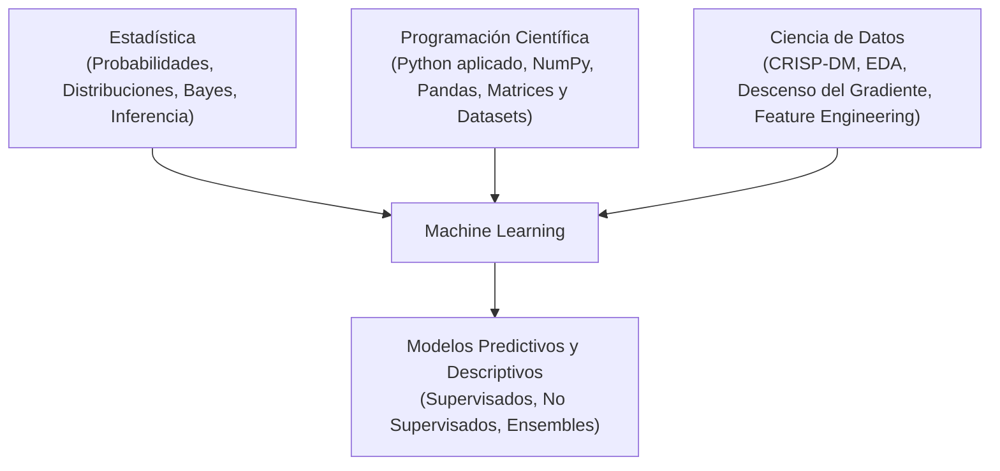
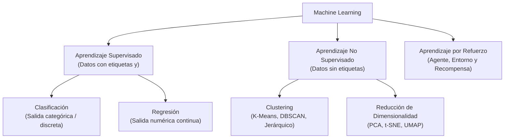
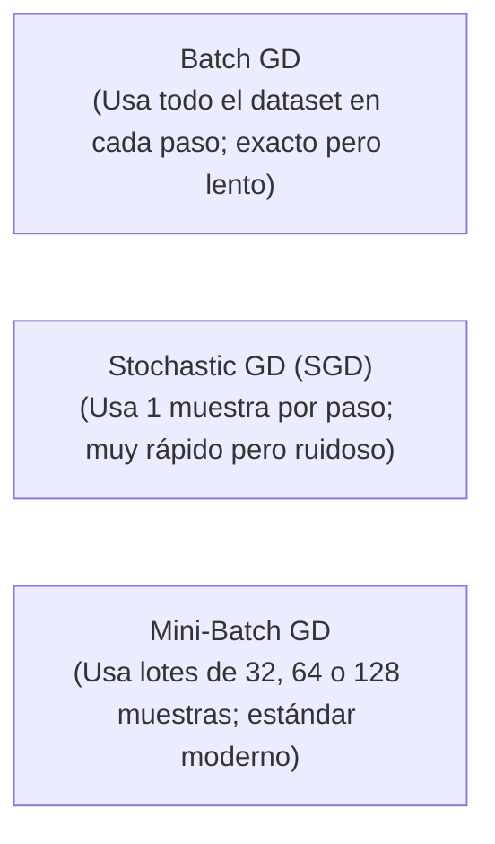
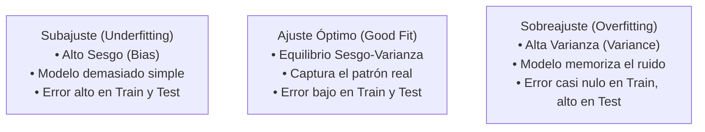
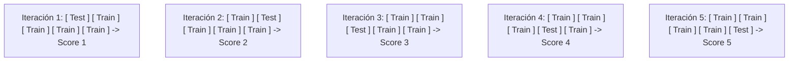

# Guía 04 — Glosario Técnico de Machine Learning

> **Objetivo:** articular los conocimientos previos de **Estadística**, **Programación Científica** y **Ciencia de Datos** con los conceptos formales, notación matemática, algoritmos, funciones de costo y métricas de evaluación de la cátedra de Machine Learning.

Esta guía se complementa con la **[Guía 00 — Git Básico](./00-git-basico.md)**, la **[Guía 01 — Git y GitHub](./01-git-y-github.md)**, la **[Guía 02 — Servidor y Conda](./02-servidor-conda.md)** y la **[Guía 03 — Nivelación Python](./03-nivelacion-python.md)**.

---

## 0. Conexión con Asignaturas Previas

Machine Learning no es una disciplina aislada; es la convergencia de lo aprendido en asignaturas anteriores:

| Asignatura Previa | Concepto Clave | Cómo se aplica en Machine Learning |
| :--- | :--- | :--- |
| **Programación Científica** | Arreglos y Matrices con NumPy | Manipulación eficiente de matrices de datos $X \in \mathbb{R}^{N \times D}$ y operaciones vectorizadas. |
| **Programación Científica** | Manipulación Tabular con Pandas | Carga, filtrado, limpieza y transformación de DataFrames estructurados. |
| **Estadística** | Teorema de Bayes | Base probabilística para inferencia en **Naive Bayes** y estimación de probabilidades a posteriori $P(y\|x)$. |
| **Estadística** | Regresión y Odds | La **Regresión Logística** modela el logaritmo de las razones de momios (*Logit* o *Log-Odds*). |
| **Estadística** | Esperanza y Varianza | Fundamento matemático del dilema **Sesgo-Varianza** (*Bias-Variance Tradeoff*). |
| **Ciencia de Datos** | Metodología CRISP-DM | Marco de trabajo iterativo: Negocio $\rightarrow$ Datos $\rightarrow$ Preparación $\rightarrow$ Modelado $\rightarrow$ Evaluación. |
| **Ciencia de Datos** | Descenso del Gradiente | Optimización iterativa de parámetros minimizando la función de costo ($\nabla J(\theta)$). |

---

## 1. Notación Matemática y Convenciones

| Símbolo | Significado | Descripción |
| :--- | :--- | :--- |
| $N$ o $m$ | Número de muestras | Cantidad total de observaciones o filas en el conjunto de datos. |
| $D$ o $p$ | Número de atributos | Cantidad de características o variables predictoras. |
| $X \in \mathbb{R}^{N \times D}$ | Matriz de características | Matriz con los datos de entrada ($N$ filas, $D$ columnas). |
| $x^{(i)} \in \mathbb{R}^D$ | Vector de la muestra $i$-ésima | Fila $i$ de la matriz $X$, representando una observación individual. |
| $y \in \mathbb{R}^N$ | Vector objetivo (*Ground Truth*) | Valores reales o etiquetas observadas que el modelo debe predecir. |
| $y^{(i)}$ | Etiqueta real de la muestra $i$ | Valor verdadero asociado a la observación $x^{(i)}$. |
| $\hat{y}^{(i)}$ | Predicción del modelo (*y-hat*) | Valor estimado o calculado por el modelo para la muestra $x^{(i)}$. |
| $\theta$ o $w$ | Vector de parámetros / pesos | Coeficientes ajustables que el modelo aprende durante el entrenamiento. |
| $b$ o $\theta_0$ | Sesgo (*Bias*) / Intercepto | Término constante independiente de las variables de entrada. |
| $J(\theta)$ o $\mathcal{L}$ | Función de costo (*Cost function*) | Medida cuantitativa del error acumulado del modelo sobre el dataset. |
| $\nabla J(\theta)$ | Gradiente de la función de costo | Vector de derivadas parciales que indica la dirección de mayor crecimiento del error. |

---

## 2. Paradigmas de Aprendizaje

### 2.0 Definición Formal de Machine Learning (Tom Mitchell, 1997)
> *"Un programa aprende de la **Experiencia ($E$)** con respecto a una **Tarea ($T$)** y una **Medida de Desempeño ($P$)**, si su desempeño en las tareas de $T$, medido por $P$, mejora con la experiencia $E$."*

* **Tarea ($T$):** Lo que el modelo debe resolver (ej: clasificar correos en spam/no-spam).
* **Experiencia ($E$):** Los datos históricos o de entrenamiento suministrados.
* **Desempeño ($P$):** La métrica cuantitativa para evaluar el éxito (ej: exactitud o $F_1$-score).

---

### 2.1 Aprendizaje Supervisado
El algoritmo aprende a partir de pares ordenados $\{(x^{(1)}, y^{(1)}), (x^{(2)}, y^{(2)}), \dots, (x^{(N)}, y^{(N)})\}$.
* **Clasificación:** La variable objetivo $y$ es discreta/cualitativa (ej: clasificar un tumor como benigno o maligno, o categorizar noticias en temas).
* **Regresión:** La variable objetivo $y$ es continua/cuantitativa (ej: estimar el precio de una propiedad o la edad de un sujeto).

### 2.2 Aprendizaje No Supervisado
El algoritmo recibe únicamente la matriz de características $X$ sin etiquetas de salida $y$. Su objetivo es descubrir estructuras, agrupaciones o patrones latentes.
* **Clustering (Agrupamiento):** Agrupar observaciones con alta similitud interna y baja similitud externa (ej: segmentación de clientes con K-Means).
* **Reducción de Dimensionalidad:** Proyectar datos de alta dimensión a un espacio reducido preservando la máxima varianza o estructura de distancias (ej: PCA).

### 2.3 Aprendizaje por Refuerzo
Un agente aprende a tomar decisiones secuenciales interactuando con un entorno, optimizando una política mediante recompensas y castigos.

---

## 3. Parámetros vs Hiperparámetros

| Concepto | Definición | Quién lo define | Ejemplos |
| :--- | :--- | :--- | :--- |
| **Parámetros ($\theta, w, b$)** | Variables internas que el algoritmo ajusta automáticamente minimizando la función de costo. | El algoritmo durante el entrenamiento (con optimización). | Coeficientes $w$ de una regresión, pesos de una red neuronal, centroides $\mu_k$ en K-Means, vectores de soporte en SVM. |
| **Hiperparámetros** | Configuraciones externas que controlan la capacidad, regularización y dinámica del aprendizaje. | El científico de datos antes de entrenar (o mediante validación cruzada / GridSearchCV). | Tasa de aprendizaje ($\alpha$), número de vecinos ($k$), profundidad máxima de un árbol, regularización ($C$, $\lambda$), número de clusters ($k$). |

---

## 4. Optimización: Descenso del Gradiente (*Gradient Descent*)

Es el algoritmo de optimización fundamental en Machine Learning para encontrar los parámetros $\theta$ que minimizan la función de costo $J(\theta)$.

### Regla de actualización:
$$\theta \leftarrow \theta - \alpha \nabla J(\theta)$$

Donde $\alpha > 0$ es la **tasa de aprendizaje (*learning rate*)**:
* Si $\alpha$ es **muy pequeño:** el entrenamiento es extremadamente lento.
* Si $\alpha$ es **muy grande:** el algoritmo puede oscilar o divergir sin encontrar el mínimo.

---

## 5. Funciones de Pérdida y de Costo

* **Función de Pérdida ($L(\hat{y}^{(i)}, y^{(i)})$):** Error en una **única muestra** individual.
* **Función de Costo ($J(\theta)$):** Promedio del error en **todo el conjunto de datos**.

### 5.1 Para Problemas de Regresión

#### Error Cuadrático Medio (MSE - *Mean Squared Error*)
Penaliza con mayor fuerza los errores grandes debido a la potencia cuadrática (sensible a *outliers*):

$$MSE = \frac{1}{N} \sum_{i=1}^N \left(y^{(i)} - \hat{y}^{(i)}\right)^2$$

#### Error Absoluto Medio (MAE - *Mean Absolute Error*)
Mide la magnitud promedio del error en escala lineal (robusto frente a *outliers*):

$$MAE = \frac{1}{N} \sum_{i=1}^N |y^{(i)} - \hat{y}^{(i)}|$$

---

### 5.2 Para Problemas de Clasificación

#### Entropía Cruzada Binaria / Log-Loss (*Binary Cross-Entropy*)
Derivada del principio estadístico de Máxima Verosimilitud (*Maximum Likelihood Estimation - MLE*). Se utiliza cuando la salida del modelo $\hat{y} = \sigma(z) \in [0, 1]$ es una probabilidad:

$$J(\theta) = -\frac{1}{N} \sum_{i=1}^N \left[ y^{(i)} \log(\hat{y}^{(i)}) + (1 - y^{(i)}) \log(1 - \hat{y}^{(i)}) \right]$$

* Si $y^{(i)} = 1$ y el modelo predice $\hat{y}^{(i)} \approx 1$, el costo es $\approx 0$.
* Si $y^{(i)} = 1$ y el modelo predice $\hat{y}^{(i)} \approx 0$, el costo tiende a $\infty$.

---

## 6. Generalización y el Dilema Sesgo-Varianza (*Bias-Variance Tradeoff*)

El objetivo del aprendizaje no es memorizar los datos de entrenamiento, sino **generalizar** ante observaciones nuevas.

Matemáticamente, para cualquier modelo $\hat{f}(x)$, el error esperado sobre datos de prueba se descompone en:

$$\mathbb{E}\left[(y - \hat{f}(x))^2\right] = \underbrace{\text{Sesgo}^2(\hat{f}(x))}_{\text{Incapacidad del modelo}} + \underbrace{\text{Var}(\hat{f}(x))}_{\text{Sensibilidad al dataset}} + \underbrace{\sigma^2}_{\text{Ruido irreducible}}$$

| Condición | Diagnóstico | Cómo solucionarlo |
| :--- | :--- | :--- |
| **Subajuste (*Underfitting*)** | El modelo no aprende el patrón subyacente (ej. ajustar una recta a datos cuadráticos). | Aumentar la complejidad del modelo, crear nuevas características (*feature engineering*) o reducir regularización. |
| **Sobreajuste (*Overfitting*)** | El modelo memoriza el ruido específico del conjunto de entrenamiento. | Recopilar más datos, aplicar **regularización ($L_1 / L_2$)**, seleccionar menos variables o usar técnicas de ensamble (*Bagging*). |

---

### 6.1 Técnicas de Regularización ($L_1$ vs $L_2$)

La regularización penaliza la complejidad del modelo sumando la norma de los pesos a la función de costo: $J_{reg}(\theta) = J(\theta) + \lambda \cdot \Omega(\theta)$.

* **Regularización $L_1$ (Lasso):** $\Omega(\theta) = \sum_{j=1}^D |\theta_j|$. Anula exactamente los coeficientes de las variables irrelevantes ($\theta_j = 0$), produciendo modelos **dispersos (*sparse*)** y realizando **selección automática de características**.
* **Regularización $L_2$ (Ridge):** $\Omega(\theta) = \sum_{j=1}^D \theta_j^2$. Contrae todos los coeficientes hacia cero de forma suave sin eliminarlos por completo, siendo ideal para combatir la **multicolinealidad**.
* **ElasticNet:** Combina ponderadamente penalizaciones $L_1$ y $L_2$.

---

## 7. Estrategias de Validación Experimental

Nunca se debe evaluar un modelo sobre los mismos datos con los que fue entrenado.

### 7.1 Partición Hold-Out (Train / Validation / Test)

* **Train Set (60-80%):** Datos utilizados por el algoritmo para aprender los parámetros $\theta$.
* **Validation Set (10-20%):** Datos utilizados para comparar familias de modelos y optimizar hiperparámetros (ej. seleccionar el mejor $k$ o $C$).
* **Test Set (10-20%):** Conjunto aislado que se evalúa **una sola vez al final** para estimar el error de generalización real del proyecto.

---

### 7.2 Validación Cruzada ($K$-Fold Cross-Validation)

Divide el conjunto de entrenamiento en $K$ particiones iguales. El modelo se entrena $K$ veces, usando cada vez $K-1$ bloques para ajustar y 1 bloque para validar:

$$\text{Rendimiento CV} = \frac{1}{K} \sum_{k=1}^K \text{Score}_k \pm \text{Desviación Estándar}$$

* **Stratified $K$-Fold:** Variante obligatoria para problemas de clasificación con clases desbalanceadas que preserva el porcentaje de cada clase en cada fold.

---

### 7.3 Fuga de Datos (*Data Leakage*)
Ocurre cuando información del conjunto de prueba contamina el entrenamiento (por ejemplo, calcular la media global antes de dividir en train/test). Para evitarlo, todo preprocesamiento debe encapsularse en un `Pipeline` de Scikit-Learn.

---

## 8. Métricas de Evaluación Formales

### 8.1 Para Clasificación

#### Matriz de Confusión
Tabla de contingencia que cruza los valores reales con las predicciones del modelo:

| | Predicción Positiva ($\hat{y} = 1$) | Predicción Negativa ($\hat{y} = 0$) |
| :--- | :---: | :---: |
| **Real Positivo ($y = 1$)** | **Verdadero Positivo ($TP$)** | **Falso Negativo ($FN$)** *(Error Tipo II)* |
| **Real Negativo ($y = 0$)** | **Falso Positivo ($FP$)** *(Error Tipo I)* | **Verdadero Negativo ($TN$)** |

---

#### Fórmulas de Clasificación:

* **Exactitud (*Accuracy*):** Proporción global de aciertos. No es representativa en datasets con clases desbalanceadas:
  $$Accuracy = \frac{TP + TN}{TP + TN + FP + FN}$$

* **Precisión (*Precision*):** De todos los casos predichos como positivos, ¿cuántos eran realmente positivos? (Crítica cuando los falsos positivos son costosos, ej: detección de spam):
  $$Precision = \frac{TP}{TP + FP}$$

* **Exhaustividad / Sensibilidad (*Recall* / *Sensitivity*):** De todos los casos positivos reales, ¿cuántos logró detectar el modelo? (Crítica en medicina o fraudes, donde no se pueden tolerar falsos negativos):
  $$Recall = \frac{TP}{TP + FN}$$

* **Especificidad (*Specificity*):** Proporción de verdaderos negativos identificados sobre el total de negativos reales ($TN / (TN + FP)$).

* **F1-Score:** Media armónica entre Precisión y Exhaustividad. Métrica estándar para comparar clasificadores en datasets desbalanceados:
  $$F_1 = 2 \cdot \frac{Precision \cdot Recall}{Precision + Recall} = \frac{2 \cdot TP}{2 \cdot TP + FP + FN}$$

* **Curva ROC y AUC (*Area Under the ROC Curve*):**
  * Grafica el *Recall* (eje Y) frente a la tasa de falsos positivos ($1 - \text{Especificidad}$, eje X) a lo largo de todos los umbrales de decisión posibles.
  * **AUC = 1.0:** Clasificador perfecto.
  * **AUC = 0.5:** Clasificador equivalente al azar (lanzar una moneda).

---

### 8.2 Para Regresión

* **Mean Squared Error (MSE):** $\frac{1}{N}\sum (y - \hat{y})^2$
* **Root Mean Squared Error (RMSE):** $\sqrt{MSE}$ (interpretable en las mismas unidades de la variable $y$).
* **Mean Absolute Error (MAE):** $\frac{1}{N}\sum |y - \hat{y}|$
* **Coeficiente de Determinación ($R^2$):** Proporción de la variabilidad total de $y$ explicada por las características del modelo:
  $$R^2 = 1 - \frac{\sum_{i=1}^N (y^{(i)} - \hat{y}^{(i)})^2}{\sum_{i=1}^N (y^{(i)} - \bar{y})^2}$$
  * $R^2 = 1.0$: Ajuste perfecto.
  * $R^2 = 0.0$: El modelo predice igual que la media simple $\bar{y}$.
  * $R^2 < 0.0$: El modelo tiene peor rendimiento que la media constante.

---

### 8.3 Para Clustering (No Supervisado)

* **Inercia (*Within-Cluster Sum of Squares - WCSS*):** Suma de las distancias euclidianas al cuadrado de cada muestra a su centroide asignado. Se usa en el **Método del Codo (*Elbow Method*)** para estimar el número óptimo de clusters $k$.
* **Coeficiente de Silueta (*Silhouette Score*):** Evalúa la cohesión interna frente a la separación con otros clusters:
  * Rango de $-1$ a $+1$.
  * Cercano a $+1$: Muestra muy bien asignada a su cluster y distante de los demás.
  * Cercano a $0$: Muestra en la frontera de decisión entre dos clusters.
  * Negativo: Muestra probablemente asignada al cluster incorrecto.

---

## 9. Algoritmos Fundamentales de la Cátedra

| Algoritmo | Familia | Idea Matemática / Mecanismo | Hiperparámetros Clave |
| :--- | :--- | :--- | :--- |
| **Regresión Lineal** | Supervisado (Regresión) | Modela la relación lineal mediante Mínimos Cuadrados Ordinarios (OLS) o Descenso del Gradiente: $\hat{y} = Xw + b$. | `fit_intercept`, penalización (`alpha` en Ridge/Lasso). |
| **Regresión Logística** | Supervisado (Clasificación) | Aplica la función sigmoide $\sigma(z) = \frac{1}{1 + e^{-z}}$ sobre la combinación lineal para estimar probabilidades $P(y=1\|x)$. | `C` (inverso de regularización), `penalty` ('l1', 'l2', 'elasticnet'). |
| **Naive Bayes** | Supervisado (Clasificación) | Clasificador probabilístico basado en el Teorema de Bayes asumiendo independencia condicional entre atributos. | `var_smoothing` (Gaussiano), `alpha` (Laplace smoothing). |
| **K-Nearest Neighbors (KNN)** | Supervisado | Clasifica o predice según la mayoría de votos o promedio de las $k$ instancias más cercanas en el espacio vectorial. | `n_neighbors` ($k$), `metric` ('euclidean', 'manhattan', 'minkowski'). |
| **Support Vector Machines (SVM)** | Supervisado | Encuentra el hiperplano óptimo que maximiza el margen geométrico entre clases. Aplica el **Kernel Trick** (RBF, Polinomial) para fronteras no lineales. | `C` (tolerancia a infracciones de margen), `kernel` ('linear', 'rbf', 'poly'), `gamma`. |
| **Árboles de Decisión (CART)** | Supervisado | Divide el espacio mediante particiones binarias recursivas optimizando la impureza de Gini o la Entropía / Ganancia de Información. | `max_depth`, `min_samples_split`, `min_samples_leaf`, `criterion`. |
| **Random Forest (Bagging)** | Supervisado (*Ensemble*) | Entrena múltiples árboles de decisión independientes con muestreo con reemplazo (*Bootstrap*) y subconjuntos aleatorios de atributos para **reducir varianza**. | `n_estimators` (número de árboles), `max_features`, `max_depth`. |
| **AdaBoost / Gradient Boosting** | Supervisado (*Ensemble*) | Entrena árboles de forma secuencial, donde cada nuevo estimador se enfoca en corregir los errores residuales de los anteriores para **reducir sesgo**. | `n_estimators`, `learning_rate`, `max_depth`. |
| **K-Means** | No Supervisado (Clustering) | Agrupa los datos en $k$ clusters actualizando iterativamente los centroides $\mu_k$ hasta converger. | `n_clusters` ($k$), `init` ('k-means++'), `n_init`. |
| **PCA (Componentes Principales)** | No Supervisado (Extracción) | Proyecta los datos en los autovectores de la matriz de covarianza ordenados por sus autovalores (varianza explicada). | `n_components` (número de componentes o % de varianza deseado). |
